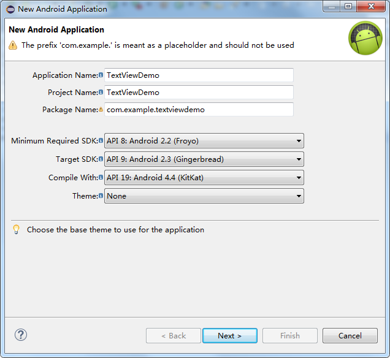
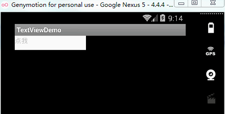

# 百战经典第一战—听话的TextView

TextView作为Android开发中最最常用的控件，是我们第一个要解决的敌人。

TextView的继承结构如下，可以看出TextView继承自View。

```
java.lang.Object
   ↳	android.view.View
 	   ↳	android.widget.TextView
```

下面通过代码介绍一下TextView的基本使用，新建项目：



默认什么都不做，运行项目：


  
可以看出项目中已经有一个TextView了，TextView上的字符串是Hello World，体现了TextView控件的重要性，

下面在TextView做一些小交互，让TextView变得U意思。代码如下：
 
```
package com.example.textviewdemo;
//省略导入包
public class MainActivity extends Activity {
	TextView mTextView=null;
	@Override
	protected void onCreate(Bundle savedInstanceState) {
		super.onCreate(savedInstanceState);
		setContentView(R.layout.activity_main);
		mTextView=(TextView)findViewById(R.id.tv_first);
		mTextView.setOnClickListener(new OnClickListener() {
			@Override
			public void onClick(View v) {
				mTextView.setText((int)(Math.random()*9000+1000)+"");
			}
		});
	}
}
```

这里实现了TextView的单击监听，点击一次TextView产生一个随机的四位数，显示到TextView中，类似验证码的效果。

运行项目：


点击TextView，数字发生改变：


当然可以添加一下颜色在里面，修改activity_main.xml布局文件，改变背景：

```
<LinearLayout xmlns:android="http://schemas.android.com/apk/res/android"
    xmlns:tools="http://schemas.android.com/tools"
    android:layout_width="match_parent"
    android:layout_height="match_parent" >
    <TextView
        android:id="@+id/tv_first"
        android:layout_width="150dp"
        android:layout_height="30dp"
        android:background="#ffffff"
        android:text="@string/hello_world" />
</LinearLayout>
```

运行项目：


也可以通过代码：

```
mTextView.setTextColor(Color.GREEN);
```

设置字体的颜色。

还可以通过如下代码，实现点击时颜色随机改变：

```
package com.example.textviewdemo;
//省略导入包
public class MainActivity extends Activity {
	private TextView mTextView=null;
	private int color[]={Color.GREEN,Color.BLACK,Color.GRAY,Color.YELLOW,Color.RED};
	private int i=0;
	@Override
	protected void onCreate(Bundle savedInstanceState) {
		super.onCreate(savedInstanceState);
		setContentView(R.layout.activity_main);
		mTextView=(TextView)findViewById(R.id.tv_first);
		mTextView.setOnClickListener(new OnClickListener() {
			@Override
			public void onClick(View v) {
				mTextView.setText((int)(Math.random()*9000+1000)+"");
				mTextView.setTextColor(color[new Random().nextInt(4)]);
			}
		});
	}
}
```

运行如下：



TextView的属性和方法还有很多很多，篇幅限制，不能一一介绍，感兴趣的同学可以看一看官方API文档，挑选自己感兴趣的属性和方法测试一下，加深学习印象。