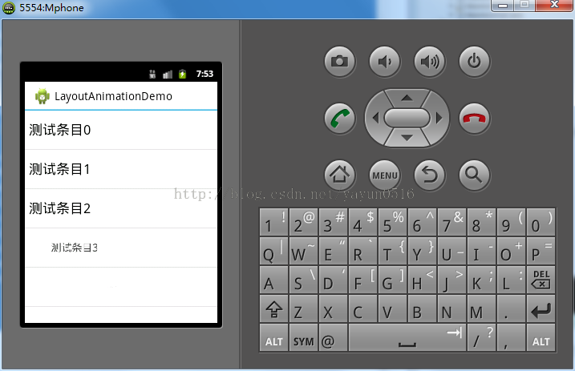

# 百战经典第十战-LayoutAnimation布局动画效果

我们对Tween和Frame动画比较熟悉，下面通过一个实例来了解一下LayoutAnimation(布局动画)
首先要建立一个动画文件zoom_in.xml:

```
<?xml version="1.0" encoding="utf-8"?>  
<set xmlns:android="http://schemas.android.com/apk/res/android" >  
    <scale  
        android:duration="1000"  
        android:fromXScale="0.1"  
        android:fromYScale="0.1"  
        android:pivotX="50%"  
        android:pivotY="50%"  
        android:toXScale="1.0"  
        android:toYScale="1.0" />  
    <alpha  
        android:duration="1000"  
        android:fromAlpha="0"  
        android:toAlpha="1.0" />  
</set> 
```

这是一个大小和渐变的组合动画，scale是尺寸动画，`from*Scale`和`to*Scale`指定了初始和结束时的大小，alpha是一个渐变动画，duration表示渐变的持续时间，fromAlpha和toAlpha指定了初始的和结束的透明度。
MainActivity.java:

```
package com.example.layoutanimationdemo;   
  
public class MainActivity extends ActionBarActivity {  
    private List list = new ArrayList();  
    private ListView listView;  
    @Override  
    protected void onCreate(Bundle savedInstanceState) {  
        super.onCreate(savedInstanceState);  
        setContentView(R.layout.activity_main);  
        listView = (ListView) findViewById(R.id.list);  
        for (int i = 0; i < 20; i++) {  
            list.add("测试条目" + i);  
        }  
        ArrayAdapter<String> adapter = new ArrayAdapter<String>(  
                MainActivity.this, android.R.layout.simple_list_item_1, list);  
        listView.setAdapter(adapter);  
        LayoutAnimationController layoutAnimationController = new LayoutAnimationController(  
                AnimationUtils.loadAnimation(this, R.anim.zoom_in));  
        layoutAnimationController  
                .setOrder(LayoutAnimationController.ORDER_NORMAL);  
        listView.setLayoutAnimation(layoutAnimationController);  
        listView.startLayoutAnimation();  
  
    }  
}  
```
考虑到版面问题，这里省略掉了导入的包，在IDE中这些包都可以自行导入。代码比较简单实现，不懂的可以参照总结部分。
运行项目：



可以看到ListView中的条目一个个显示出来，动画效果可以让我们的应用交互性更强，用户体验更好，逼格也更高。

### 总结

1.实例化LayoutAnimationController 控制器，结合AnimationUtils工具类的loadAnimation方法引入动画文件；
2.`setOrder(LayoutAnimationController.ORDER_NORMAL);`设置显示顺序，多种显示风格可选；
 
- （a）int	ORDER_NORMAL	Distributes the animation delays in the order in which view were added to their view group.//正常动画，由上往下
- （b）int	ORDER_RANDOM	Randomly distributes the animation delays.//随机动画
- （c）int	ORDER_REVERSE	Distributes the animation delays in the reverse order in which view were added to their view group.//倒序动画

3.`listView.setLayoutAnimation(layoutAnimationController);`//设定动画  
  `listView.startLayoutAnimation();`//启动动画