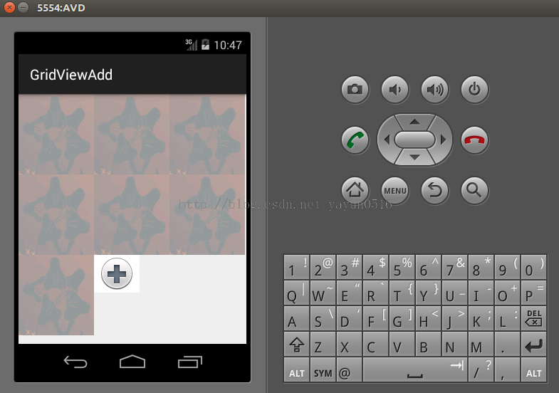

# 百战经典第十一战-GridView动态添加Item

在实际开发项目中，本实例经常被用到，GridView的最后项显示一个增加图片的按钮，点击该按钮可以动态增加Item。

1.main.xml:

```
<RelativeLayout xmlns:android="http://schemas.android.com/apk/res/android"  
    xmlns:tools="http://schemas.android.com/tools"  
    android:layout_width="match_parent"  
    android:layout_height="match_parent" >  
    <GridView  
        android:id="@+id/gv_test"  
        android:numColumns="3"  
        android:layout_width="match_parent"  
        android:layout_height="match_parent" />  
</RelativeLayout>  
```

布局文件很简单，在相对布局中引入了一个gridview控件，numColumns属性指定了一行显示3项。

2.grid_item.xml：

```
<?xml version="1.0" encoding="utf-8"?>  
<LinearLayout xmlns:android="http://schemas.android.com/apk/res/android"  
    android:layout_width="match_parent"  
    android:layout_height="match_parent"  
    android:orientation="vertical" >  
    <ImageView  
        android:id="@+id/item"  
        android:layout_width="wrap_content"  
        android:layout_height="wrap_content" />  
</LinearLayout>  
```

gridview的子布局就一个imageview控件，用于显示图片。

3.GridViewAdapter.java:

```
package com.yayun.gridviewdemo; 
//省略导入 
public class GridViewAdapter extends BaseAdapter {  
    private Context context;  
    private List<Integer> list;  
    LayoutInflater layoutInflater;  
    private ImageView mImageView;  
    public GridViewAdapter(Context context, List<Integer> list) {  
        this.context = context;  
        this.list = list;  
        layoutInflater = LayoutInflater.from(context);  
    }  
    @Override  
    public int getCount() {  
        return list.size()+1;//注意此处  
    }  
    @Override  
    public Object getItem(int position) {  
        return list.get(position);  
    }  
    @Override  
    public long getItemId(int position) {  
        return position;  
    }  
    @Override  
    public View getView(int position, View convertView, ViewGroup parent) {  
        convertView = layoutInflater.inflate(R.layout.grid_item, null);  
        mImageView = (ImageView) convertView.findViewById(R.id.item);  
        if (position < list.size()) {  
            mImageView.setBackgroundResource(list.get(position));  
        }else{  
            mImageView.setBackgroundResource(R.drawable.pic3);//最后一个显示加号图片  
        }  
        return convertView;  
    }  
} 
```

创建适配器类，继承自BaseAdapter适配器，适配器类构造方法传入上下文对象context和数据集合List。要注意的地方，getCount方法返回的数量要加1，这个就是存放“+”的地方。在getView方法中，进行判断，最后一个位置设置加号图片。

4.MainActivity.java:

```
package com.yayun.gridviewdemo;  
  //省略导入的包 
public class MainActivity extends ActionBarActivity {  
    private List<Integer> mDatas;  
private GridView mGridView;  
private GridViewAdapter adapter;  
    @Override  
    protected void onCreate(Bundle savedInstanceState) {  
        super.onCreate(savedInstanceState);  
        setContentView(R.layout.activity_main);  
        mGridView=(GridView) findViewById(R.id.gv_test);  
        initDatas(); //初始化数据 
        adapter=new GridViewAdapter(MainActivity.this,mDatas);  
        mGridView.setAdapter(adapter);  
        mGridView.setOnItemClickListener(new OnItemClickListener() {  
            @Override  
            public void onItemClick(AdapterView<?> parent, View view,  
                    int position, long id) {  
                if(position==parent.getChildCount()-1){  
                    mDatas.add(R.drawable.pic1);  
                    Toast.makeText(MainActivity.this, "您点击了添加", 1).show();  
                    adapter=new GridViewAdapter(MainActivity.this, mDatas);  
                    mGridView.setAdapter(adapter);  
                    adapter.notifyDataSetChanged();  
                }    
            }  
        });     
    }  
    private void initDatas() {  
        mDatas=new ArrayList<>();  
        mDatas.add(R.drawable.pic1);  
        mDatas.add(R.drawable.pic1);  
        mDatas.add(R.drawable.pic1);  
        mDatas.add(R.drawable.pic1);  
        mDatas.add(R.drawable.pic1);  
      }  
    } 
```

设置了GridView的setOnItemClickListener监听事件，由条件：position==parent.getChildCount()-1判断是否点击了最后一个带有加号图片的项目，若单击了则重新生成一项加入到mDatas中去，并调用notifyDataSetChanged方法重绘GridView控件。

运行项目：



点击最后一个+图片，可以动态增加item。