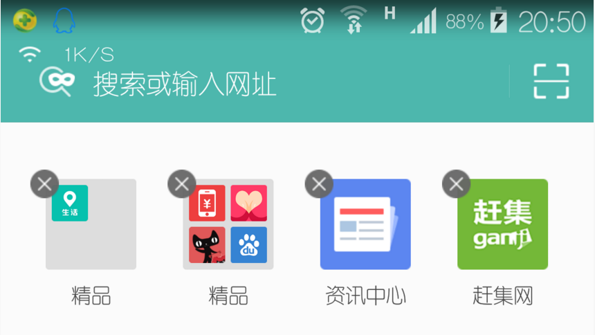

# 百战经典第十二战-GridView动态删除Item

用过UC浏览器的都熟悉如下功能：



长按图标会弹出删除的图标，点击删除会删除此项Item，下面研究一下如何实现类似效果。

1.配置布局main.xml文件：

```
<RelativeLayout xmlns:android="http://schemas.android.com/apk/res/android"  
    xmlns:tools="http://schemas.android.com/tools"  
    android:layout_width="match_parent"  
    android:layout_height="match_parent" >  
    <GridView  
        android:id="@+id/gridView"  
        android:layout_width="match_parent"  
        android:layout_height="wrap_content"  
        android:numColumns="4" >  
    </GridView>  
</RelativeLayout>  
```

2.配置GridView的填充组件布局 grid_item.xml:

```
<?xml version="1.0" encoding="utf-8"?>  
<LinearLayout xmlns:android="http://schemas.android.com/apk/res/android"  
    android:id="@+id/ll_grid_item"  
    android:layout_width="match_parent"  
    android:layout_height="match_parent"  
    android:gravity="center"  
    android:orientation="vertical" >  
    <FrameLayout  
        android:id="@+id/starred_item_layout"  
        android:layout_width="fill_parent"  
        android:layout_height="wrap_content"  
        android:layout_gravity="center" >  
        <LinearLayout  
            android:layout_width="fill_parent"  
            android:layout_height="wrap_content"  
            android:layout_marginRight="4dip"  
            android:layout_marginTop="4dip"  
            android:gravity="center"  
            android:orientation="vertical" >  
            <ImageView  
                android:id="@+id/img"  
                android:layout_width="60dip"  
                android:layout_height="55dip" />  
            <TextView  
                android:id="@+id/name_tv"  
                android:layout_width="70dip"  
                android:layout_height="wrap_content"  
                android:layout_marginTop="10dip"  
                android:gravity="center"  
                android:textColor="@android:color/black"  
                android:textSize="15sp"  
                android:textStyle="bold" />  
        </LinearLayout>  
        <ImageView  
            android:id="@+id/delete_markView"  
            android:layout_width="20dip"  
            android:layout_height="20dip"  
            android:layout_gravity="right|top"  
            android:adjustViewBounds="true"  
            android:src="@drawable/delete"  
            android:visibility="gone" />  
    </FrameLayout>  
</LinearLayout> 
```

设置了id为delete_markView的ImageView的layout_gravity属性为`right|top`，说明该图片位于右上角，设置了其visibility为gone，说明该图片初始时是不显示的，后期可以控制该图片的显示。

3.adapter适配器文件：

```
package com.example.longdemo;  
//省略导入包
public class GridViewAdapter extends BaseAdapter {  
    private ArrayList<HashMap<String, Object>> myList;  
    private Context mContext;  
    private TextView name_tv;  
    private ImageView img;  
    private View deleteView;  
    private boolean isShowDelete=false;// 根据这个变量来判断是否显示删除图标，true是显示，false是不显示  
    public GridViewAdapter(Context mContext,  
            ArrayList<HashMap<String, Object>> myList) {  
        this.mContext = mContext;  
        // this.names=names;  
        this.myList = myList;  
    }  
    public void setIsShowDelete(boolean isShowDelete) {  
        this.isShowDelete = isShowDelete;  
        notifyDataSetChanged();  
    }  
    @Override  
    public int getCount() {  
        return myList.size();  
    }  
    @Override  
    public Object getItem(int position) {  
        return myList.get(position);  
    }  
    @Override  
    public long getItemId(int position) {  
        return position;  
    }  
    @Override  
    public View getView(int position, View convertView, ViewGroup parent) {  
        convertView = LayoutInflater.from(mContext).inflate(R.layout.grid_item,  
                null);  
        img = (ImageView) convertView.findViewById(R.id.img);  
        name_tv = (TextView) convertView.findViewById(R.id.name_tv);  
        deleteView = convertView.findViewById(R.id.delete_markView);  
        deleteView.setVisibility(isShowDelete ? View.VISIBLE : View.GONE);// 设置删除按钮是否显示  
        img.setBackgroundResource(myList.get(position).get("image").hashCode());  
        name_tv.setText(myList.get(position).get("name").toString());  
        return convertView;  
    }  
}
```

设置变量isShowDelete标识是否显示删除图标，默认是false 不显示，在getView方法中通过判断该标识，使用setVisibility方法控制删除图标的显示。同时定义了setIsShowDelete方法，供调用出调用以传入isShowDelete参数的值。

4.MainActivity.java:

```
package com.example.longdemo;  
  //省略导入包
public class MainActivity extends Activity implements OnItemLongClickListener {  
    private GridView mGridView;  
    private GridViewAdapter mAdapter;  
    private boolean isShowDelete = false;  
    private ArrayList<HashMap<String, Object>> myList;  
    final String[] name = new String[] { "test", "testa", "testb", "testc", "testd",  
            "testf", "testg" };  
    final int[] pic = new int[] { R.drawable.pic,  
            R.drawable.pic, R.drawable.pic,  
            R.drawable.pic, R.drawable.pic,  
            R.drawable.pic, R.drawable.pic };  
    @Override  
    protected void onCreate(Bundle savedInstanceState) {  
        super.onCreate(savedInstanceState);  
        setContentView(R.layout.activity_main);  
        mGridView = (GridView) findViewById(R.id.gridView);  
        mGridView.setOnItemLongClickListener(this);//长按事件监听  
        myList = getMenuAdapter(pic, name);  
  
        mAdapter = new GridViewAdapter(MainActivity.this, myList);  
        mGridView.setAdapter(mAdapter);  
    }  
    @Override  
    public boolean onItemLongClick(AdapterView<?> parent, View view,  
            int position, long id) {  
        if (isShowDelete) {  
            isShowDelete = false;  
        } else {  
            isShowDelete = true;  
            mAdapter.setIsShowDelete(isShowDelete);  
            mGridView.setOnItemClickListener(new OnItemClickListener() {  
                @Override  
                public void onItemClick(AdapterView<?> parent, View view,  
                        int position, long id) {  
                    delete(position);//删除选中项  
                    Log.i("------>", "进来了么");  
                    mAdapter = new GridViewAdapter(MainActivity.this, myList);//重新绑定一次adapter  
                    mGridView.setAdapter(mAdapter);  
                    mAdapter.notifyDataSetChanged();//刷新gridview  
                }  
            });  
        }  
        Log.i("------>", "进来了没");  
        mAdapter.setIsShowDelete(isShowDelete);//setIsShowDelete()方法用于传递isShowDelete值  
        return true;  
    }  
    private void delete(int position) {//删除选中项方法  
        ArrayList<HashMap<String, Object>> newList = new ArrayList<HashMap<String, Object>>();  
        if (isShowDelete) {  
            myList.remove(position);  
            isShowDelete = false;  
        }  
        newList.addAll(myList);  
        myList.clear();  
        myList.addAll(newList);  
    }  
    private ArrayList<HashMap<String, Object>> getMenuAdapter(//将数据装入List  
            int[] menuImageArray, String[] menuNameArray) {  
        ArrayList<HashMap<String, Object>> data = new ArrayList<HashMap<String, Object>>();  
        for (int i = 0; i < menuImageArray.length; i++) {  
            HashMap<String, Object> map = new HashMap<String, Object>();  
            map.put("image", menuImageArray[i]);  
            map.put("name", menuNameArray[i]);  
            data.add(map);  
        }  
        return data;  
    }  
}  
```

MainActivity实现了OnItemLongClickListener 接口，监听GridView的长按事件。同时设置了isShowDelete 变量用于记录删除图片的显示和隐藏，设置时调用`setIsShowDelete()`方法用于传递isShowDelete值到适配器类中。设置了Map集合存储image和string的值，可以参照注释进行理解。

5.运行实例如下：


效果已经实现，结合上一节的动态添加，可以实现动态添加和删除的功能。