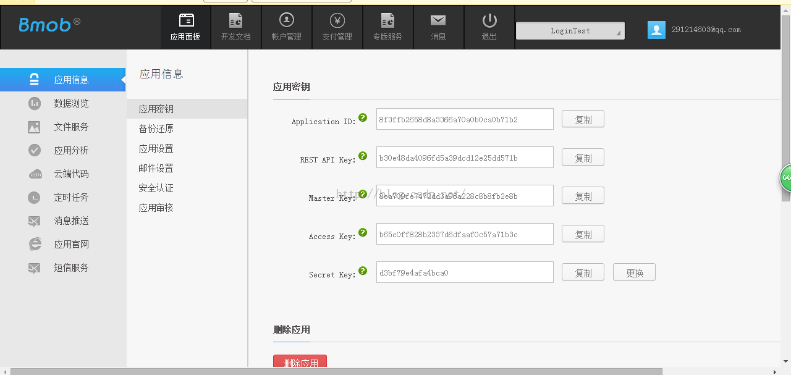
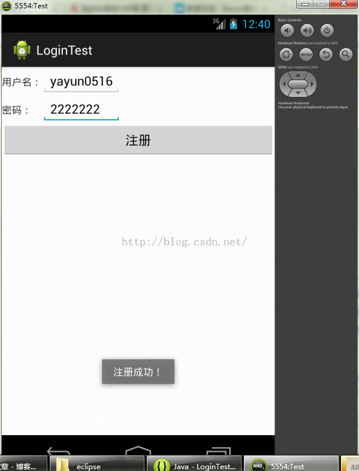
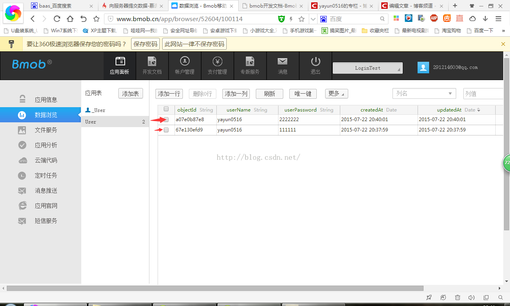

# 百战经典第十三战-网络交互，基于Baas实现用户注册功能

使用Bmob提供的API进行实战开发，Bmob的简介：Bmob平台为移动应用提供了一个完整的后端解决方案，提供轻量级的SDK开发包，让开发者以最小的配置和最简单的方式使用Bmob平台提供的服务，进而完全消除开发者编写服务器代码以及维护服务器的操作。也就是说，移动开发者不用自己开发服务器端，完全可以借助Bmob提供的API构建一个服务器端，实现移动端和服务器端的交互，属于云服务的范畴。

Bmob提供开发API文档地址为：<http://docs.bmob.cn/android/developdoc/index.html?menukey=develop_doc&key=develop_android>，读者也可以百度Bmob，进行API的学习。本节将讲解其最基本的API和方法。

注册Bmob会员，然后在Bmob官网上下载SDK，然后将jar包拷入工程内。

在Bmob网站上创建应用，获取应用key，这个key必须引入到Android项目中。如下图：



1.main.xml:

```
<RelativeLayout xmlns:android="http://schemas.android.com/apk/res/android"  
    xmlns:tools="http://schemas.android.com/tools"  
    android:layout_width="match_parent"  
    android:layout_height="match_parent" >  
    <TableLayout  
        android:id="@+id/tl"  
        android:layout_width="match_parent"  
        android:layout_height="wrap_content" >  
        <TableRow>  
            <TextView  
                android:id="@+id/tv_name"  
                android:layout_width="wrap_content"  
                android:layout_height="wrap_content"  
                android:text="用户名：" />  
            <EditText  
                android:id="@+id/et_username"  
                android:layout_width="wrap_content"  
                android:layout_height="wrap_content"  
                android:minWidth="50dp"  
                android:text="" />  
        </TableRow>  
        <TableRow>  
            <TextView  
                android:id="@+id/tv_password"  
                android:layout_width="wrap_content"  
                android:layout_height="wrap_content"  
                android:text="密码：" />  
            <EditText  
                android:id="@+id/et_password"  
                android:layout_width="wrap_content"  
                android:layout_height="wrap_content"  
                android:minWidth="50dp"  
                android:text="" />  
        </TableRow>  
    </TableLayout>  
    <Button  
        android:id="@+id/register"  
        android:layout_width="match_parent"  
        android:layout_height="wrap_content"  
        android:layout_below="@+id/tl"  
        android:onClick="submit"  
        android:text="注册" />  
</RelativeLayout>
```

采用了简单的表格布局，包括两个EditText用于记录输入的用户名和密码，一个Button注册按钮。

2.MainActivity.java:

```
package com.example.logintest;  
  //省略导入包
public class MainActivity extends Activity {  
    private EditText mUserName,mPassword;  
    @Override  
    protected void onCreate(Bundle savedInstanceState) {  
        super.onCreate(savedInstanceState);  
        setContentView(R.layout.activity_main);  
        Bmob.initialize(this, "8f3ffb2658d8a3366a70a0b0ca0b71b2");//初始化，第二项为官网创建应用的key.  
        mUserName=(EditText) findViewById(R.id.et_username);  
        mPassword=(EditText) findViewById(R.id.et_password);  
    }  
    public void submit(View view){//点击事件  
        String username=mUserName.getText().toString();  
        String password=mPassword.getText().toString();  
        if(username.equals("")||password.equals("")){  
            Toast.makeText(this, "用户名或密码不能为空！", 3).show();  
        }else{  
        User user=new User();  
        user.setUserName(username);  
        user.setUserPassword(password);  
        user.save(MainActivity.this,new SaveListener() {      
            @Override  
            public void onSuccess() {  
                Toast.makeText(MainActivity.this, "注册成功！", 3).show();     
            }  
            @Override  
            public void onFailure(int arg0, String arg1) {  
                Toast.makeText(MainActivity.this, "注册失败！", 3).show();  
            }  
        });  
      }
    }     
}  
```

onCreate方法中的 `Bmob.initialize(this, "8f3ffb2658d8a3366a70a0b0ca0b71b2");`引入了在Bmob官网上创建应用时获得的key，调用了Bmob提供的save方法，实现数据的后台存储。不熟悉的同学可以参考Bmob提供的API文档。

3.配置权限：

```
<?xml version="1.0" encoding="utf-8"?>  
<manifest xmlns:android="http://schemas.android.com/apk/res/android"  
    package="com.example.logintest"  
    android:versionCode="1"  
    android:versionName="1.0" >  
    <uses-sdk  
        android:minSdkVersion="8"  
        android:targetSdkVersion="17" />  
    <uses-permission android:name="android.permission.INTERNET" />  
    <uses-permission android:name="android.permission.ACCESS_WIFI_STATE" />  
    <uses-permission android:name="android.permission.ACCESS_NETWORK_STATE" />  
    <uses-permission android:name="android.permission.READ_PHONE_STATE" />  
    <uses-permission android:name="android.permission.WRITE_EXTERNAL_STORAGE" />  
    <uses-permission android:name="android.permission.READ_LOGS" />  
    <application  
        android:allowBackup="true"  
        android:icon="@drawable/ic_launcher"  
        android:label="@string/app_name"  
        android:theme="@style/AppTheme" >  
        <activity  
            android:name="com.example.logintest.MainActivity"  
            android:label="@string/app_name" >  
            <intent-filter>  
                <action android:name="android.intent.action.MAIN" />  
                <category android:name="android.intent.category.LAUNCHER" />  
            </intent-filter>  
        </activity>  
    </application>  
</manifest> 
```

主要涉及了一些权限的配置，包括网络权限、WIFI和网络状态权限、写和读取日志的权限。

4.javabean.java:

```
package com.example.logintest;   
import cn.bmob.v3.BmobObject;  
public class User extends BmobObject {  
    private String userPassword;  
    public String getUserPassword() {  
        return userPassword;  
    }  
    public void setUserPassword(String userPassword) {  
        this.userPassword = userPassword;  
    }  
    public String getUserName() {  
        return userName;  
    }  
    public void setUserName(String userName) {  
        this.userName = userName;  
    }  
    private String userName;  
}  
```

Bmob数据交互都是以对象为基础的，因此要对对象进行封装，以便更好的进行操作。

运行实例：



我们看一下Bmob官网的数据浏览，可以发现多了一个User表格，里面有两条注册数据，注册成功啦！



本节结合Bmob提供的后台云，实现了网络交互，使我们开发的Android应用跳脱了单机的限制，任何能联网的人都可以使用我们的应用。这里仅是抛砖引玉，Bmob提供了各种各样丰富的API供我们调用，发挥你的想象，可以做出一款非常实用和漂亮的APP，不妨发布到应用市场中去。
