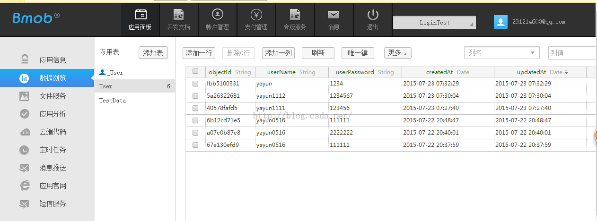

# 百战经典第十四战-网络交互，基于Baas用户表查询功能实现

接着上一篇，我们注册了几个用户，用户表如下：



下面用ListView将表中数据显示出来吧！

首先看一下main.xml：

```
<RelativeLayout xmlns:android="http://schemas.android.com/apk/res/android"  
    xmlns:tools="http://schemas.android.com/tools"  
    android:layout_width="match_parent"  
    android:layout_height="match_parent" >  
    <Button  
        android:id="@+id/btn_query"  
        android:layout_width="match_parent"  
        android:layout_height="wrap_content"  
        android:text="查询所有用户" />  
    <ListView  
        android:id="@+id/lv_users"  
        android:layout_width="match_parent"  
        android:layout_height="match_parent"  
        android:layout_below="@+id/btn_query" >  
    </ListView>  
</RelativeLayout>  
```

定义了一个按钮用于网络请求，ListView显示请求返回的信息。

然后MainActivity.java:

```
package com.example.listviewdemo;  
  
import java.util.List;  
//省略导入包
public class MainActivity extends Activity {  
    private Button mButtonQuery;  
    private ListView mListViewUsers;  
    private ListViewAdapter adapter;  
    @Override  
    protected void onCreate(Bundle savedInstanceState) {  
        super.onCreate(savedInstanceState);  
        setContentView(R.layout.activity_main);  
        Bmob.initialize(this, "8f3ffb2658d8a3366a70a0b0ca0b71b2");// 初始化Bmob  
        mButtonQuery = (Button) findViewById(R.id.btn_query);  
        mListViewUsers = (ListView) findViewById(R.id.lv_users);  
        mButtonQuery.setOnClickListener(new OnClickListenerImpl());  
    }  
    private class OnClickListenerImpl implements OnClickListener {  
        @Override  
        public void onClick(View v) {  
            BmobQuery<User> query = new BmobQuery<User>();// 查询类  
            query.findObjects(MainActivity.this, new FindListener<User>() {  
                @Override  
                public void onSuccess(List<User> list) {  
                    adapter = new ListViewAdapter(MainActivity.this, list);// 实例化  
                    mListViewUsers.setAdapter(adapter);  
                }  
                @Override  
                public void onError(int arg0, String arg1) {  
                    Toast.makeText(MainActivity.this, "查询失败！", 3).show();  
                }  
            });  
        }  
    }  
} 
```

这里用到了BmobQuery查询类，实例化生成对象query，调用findObjects方法，覆写里面的onSuccess（请求成功）和onError（请求失败方法）。

ListViewAdapter.java:

```
package com.example.listviewdemo;  
//省略导入包 
public class ListViewAdapter extends BaseAdapter {  
    private Context context;  
    private List<User> list;  
    private LayoutInflater inflater;  
    public ListViewAdapter(Context context, List<User> list) {  
        this.context = context;  
        this.list = list;  
        inflater = LayoutInflater.from(context);  
    }  
    @Override  
    public int getCount() {  
        return list.size();  
    }  
    @Override  
    public Object getItem(int position) {  
        return list.get(position);  
    }  
    @Override  
    public long getItemId(int position) {  
        return position;  
    }  
    @Override  
    public View getView(int position, View convertView, ViewGroup parent) {  
        ViewHolder viewHolder = null;  
        if (convertView == null) {  
            viewHolder = new ViewHolder();  
            convertView = inflater.inflate(R.layout.listview_item, null);  
            viewHolder.tv_idTextView = (TextView) convertView  
                    .findViewById(R.id.tv_id);  
            viewHolder.tv_usernameTextView = (TextView) convertView  
                    .findViewById(R.id.tv_username);  
            viewHolder.tv_userPasswordTextView = (TextView) convertView  
                    .findViewById(R.id.tv_userpassword);  
            viewHolder.tv_timeTextView = (TextView) convertView  
                    .findViewById(R.id.tv_time);  
            convertView.setTag(viewHolder);  
        } else {  
            viewHolder = (ViewHolder) convertView.getTag();  
        }  
        viewHolder.tv_idTextView  
                .setText(list.get(position).getObjectId() + "|");  
        viewHolder.tv_usernameTextView.setText(list.get(position).getUserName()  
                + "|");  
        viewHolder.tv_userPasswordTextView.setText(list.get(position)  
                .getUserPassword() + "|");  
        viewHolder.tv_timeTextView.setText(list.get(position).getCreatedAt());  
        return convertView;  
    }  
    class ViewHolder {  
        private TextView tv_idTextView;  
        private TextView tv_usernameTextView;  
        private TextView tv_userPasswordTextView;  
        private TextView tv_timeTextView;  
    }  
}
```

目前为止，适配器类的编写大家都应该很熟悉了，不用再解释。

list_item.xml:

```
<?xml version="1.0" encoding="utf-8"?>  
<LinearLayout xmlns:android="http://schemas.android.com/apk/res/android"  
    android:layout_width="match_parent"  
    android:layout_height="match_parent"  
    android:orientation="horizontal" >  
    <TextView  
        android:id="@+id/tv_id"  
        android:layout_width="wrap_content"  
        android:layout_height="wrap_content" />  
    <TextView  
        android:id="@+id/tv_username"  
        android:layout_width="wrap_content"  
        android:layout_height="wrap_content" />  
    <TextView  
        android:id="@+id/tv_userpassword"  
        android:layout_width="wrap_content"  
        android:layout_height="wrap_content" />  
    <TextView  
        android:id="@+id/tv_time"  
        android:layout_width="wrap_content"  
        android:layout_height="wrap_content" />  
</LinearLayout>  
```

User.java:

```
package com.example.logintest;   
import cn.bmob.v3.BmobObject;  
public class User extends BmobObject {  
    private String userPassword;  
    public String getUserPassword() {  
        return userPassword;  
    }  
    public void setUserPassword(String userPassword) {  
        this.userPassword = userPassword;  
    }  
    public String getUserName() {  
        return userName;  
    }  
    public void setUserName(String userName) {  
        this.userName = userName;  
    }  
    private String userName;  
}  
```

最后配置文件：

```
<?xml version="1.0" encoding="utf-8"?>  
<manifest xmlns:android="http://schemas.android.com/apk/res/android"  
    package="com.example.listviewdemo"  
    android:versionCode="1"  
    android:versionName="1.0" >  
    <uses-sdk  
        android:minSdkVersion="8"  
        android:targetSdkVersion="17" />  
    <uses-permission android:name="android.permission.INTERNET" />  
    <uses-permission android:name="android.permission.ACCESS_WIFI_STATE" />  
    <uses-permission android:name="android.permission.ACCESS_NETWORK_STATE" />  
    <uses-permission android:name="android.permission.READ_PHONE_STATE" />  
    <uses-permission android:name="android.permission.WRITE_EXTERNAL_STORAGE" />  
    <uses-permission android:name="android.permission.READ_LOGS" />  
    <application  
        android:allowBackup="true"  
        android:icon="@drawable/ic_launcher"  
        android:label="@string/app_name"  
        android:theme="@style/AppTheme" >  
        <activity  
            android:name="com.example.listviewdemo.MainActivity"  
            android:label="@string/app_name" >  
            <intent-filter>  
                <action android:name="android.intent.action.MAIN" />  
                <category android:name="android.intent.category.LAUNCHER" />  
            </intent-filter>  
        </activity>  
    </application>  
</manifest>  

```

运行实例：


所有用户数据都被请求到本地了。
