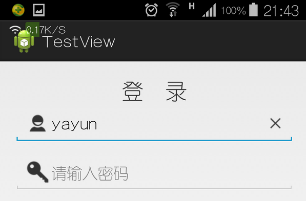

# 百战经典第十八战-自定义控件实现一键清空输入框

自定义View实现登录注册页面的EditText一键清空功能，效果如下： 



输入框输入文字后自动出现一键清空键，输入框文字为空时，一键清空键隐藏，下面我们看一下如何通过自定义View实现这一效果。 

看一下DeletableEditText.java:

```
package com.example.testview;
//省略导入包
/**
 * @author yayun email:291214603@qq.com blog: http://blog.csdn.net/yayun0516
 * @date 2015-08-11 TODO
 */
public class DeletableEditText extends EditText {
    private Drawable mRightDrawable;
    private boolean isHasFocus;
    public DeletableEditText(Context context) {
        super(context);
        init();
    }
    public DeletableEditText(Context context, AttributeSet attrs) {
        super(context, attrs);
        init();
    }
    public DeletableEditText(Context context, AttributeSet attrs, int defStyle) {
        super(context, attrs, defStyle);
        init();
    }
    private void init() {
        Drawable[] drawables = this.getCompoundDrawables();

        // 取得right位置的Drawable
        // 即我们在布局文件中设置的android:drawableRight
        mRightDrawable = drawables[2];
        // 设置焦点变化的监听
        this.setOnFocusChangeListener(new FocusChangeListenerImpl());
        // 设置EditText文字变化的监听
        this.addTextChangedListener(new TextWatcherImpl());
        // 初始化时让右边clean图标不可见
        setClearDrawableVisible(false);
    }
    /**
     * 当手指抬起的位置在clean的图标的区域 我们将此视为进行清除操作 getWidth():得到控件的宽度
     * event.getX():抬起时的坐标(改坐标是相对于控件本身而言)
     * getTotalPaddingRight():clean的图标左边缘至控件右边缘的距离
     * getPaddingRight():clean的图标右边缘至控件右边缘的距离 于是: getWidth() -
     * getTotalPaddingRight()表示: 控件左边到clean的图标左边缘的区域 getWidth() -
     * getPaddingRight()表示: 控件左边到clean的图标右边缘的区域
     * 
     */
    @Override
    public boolean onTouchEvent(MotionEvent event) {
        switch (event.getAction()) {
        case MotionEvent.ACTION_UP:
            boolean isClean = (event.getX() > (getWidth() - getTotalPaddingRight()))
                    && (event.getX() < (getWidth() - getPaddingRight()));
            if (isClean) {
                setText("");
            }
            break;
        default:
            break;
        }
        return super.onTouchEvent(event);
    }
    private class FocusChangeListenerImpl implements OnFocusChangeListener {
        @Override
        public void onFocusChange(View v, boolean hasFocus) {
            isHasFocus = hasFocus;
            if (isHasFocus) {
                boolean isVisible = getText().toString().length() >= 1;
                setClearDrawableVisible(isVisible);
            } else {
                setClearDrawableVisible(false);
            }
        }
    }
    // 当输入结束后判断是否显示右边clean的图标
    private class TextWatcherImpl implements TextWatcher {
        @Override
        public void afterTextChanged(Editable s) {
            boolean isVisible = getText().toString().length() >= 1;
            setClearDrawableVisible(isVisible);
        }
        @Override
        public void beforeTextChanged(CharSequence s, int start, int count,
                int after) {
        }

        @Override
        public void onTextChanged(CharSequence s, int start, int before,
                int count) {
        }
    }
    // 隐藏或显示右边clean的图标
    protected void setClearDrawableVisible(boolean isVisible) {
        Drawable rightDrawable;
        if (isVisible) {
            rightDrawable = mRightDrawable;
        } else {
            rightDrawable = null;
        }
        // 使用代码设置该控件left, top, right, and bottom处的图标
        setCompoundDrawables(getCompoundDrawables()[0],
                getCompoundDrawables()[1], rightDrawable,
                getCompoundDrawables()[3]);
    }
    // 显示动画
    public void setShakeAnimation() {
        this.startAnimation(shakeAnimation(5));

    }
    // CycleTimes动画重复的次数
    public Animation shakeAnimation(int CycleTimes) {
        Animation translateAnimation = new TranslateAnimation(0, 10, 0, 10);
        translateAnimation.setInterpolator(new CycleInterpolator(CycleTimes));
        translateAnimation.setDuration(1000);
        return translateAnimation;
    }
}
```

DeletableEditText 继承自EditText，设置了焦点监听setOnFocusChangeListener和输入框文字变化监听addTextChangedListener，初始的时候通过setClearDrawableVisible方法设置最右边的“x”图片不可见。覆写了onTouchEvent方法，覆写了onFocusChange方法，判断在获得焦点且输入长度不为零的时候将最右边的“x”图片显示。本部分还通过shakeAnimation方法实现了动画效果，可以在Activity中调用此方法，用于判空操作。
布局文件代码：

```
<RelativeLayout xmlns:android="http://schemas.android.com/apk/res/android"
    xmlns:tools="http://schemas.android.com/tools"
    android:layout_width="match_parent"
    android:layout_height="match_parent">
    <TextView
        android:id="@+id/title"
        android:layout_width="match_parent"
        android:layout_height="wrap_content"
        android:layout_alignParentTop="true"
        android:gravity="center"
        android:text="登  录"
        android:textSize="25sp" />
    <com.example.testview.DeletableEditText
        android:id="@+id/det_test"
        android:layout_width="match_parent"
        android:layout_height="wrap_content"
        android:layout_below="@+id/title"
        android:drawableLeft="@drawable/user_account"
        android:drawableRight="@drawable/user_delete"
        android:ems="10"
        android:hint="请输入帐号名" />
    <com.example.testview.DeletableEditText
        android:id="@+id/user_password_input"
        android:layout_width="match_parent"
        android:layout_height="wrap_content"
        android:layout_below="@+id/det_test"
        android:layout_marginTop="10dp"
        android:drawableLeft="@drawable/user_password"
        android:drawableRight="@drawable/user_delete"
        android:ems="10"
        android:hint="请输入密码"
        android:inputType="textPassword"
        android:singleLine="true" />
</RelativeLayout>
```

引用自定义控件时，要输入包.类的全路径，即：`com.example.testview.DeletableEditText`。采用了相对布局的方式，并且第一个DeletableEditText控件设置了hint的属性，该属性可以作为输入框提示。第二个输入框设置了inputType为textPassword，以密文的方式显示。

