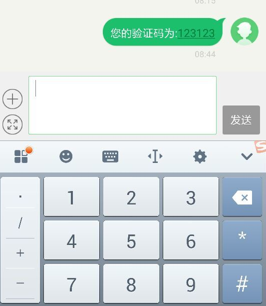

# 百战经典第十九战-短信监听实现验证码自动填入

一般用户喜欢用手机号作为用户名注册APP账号，常常通过手机验证码的方式进行验证，下面我们就研究一个非常实用的方法，通过监听短信-实现短信验证码的自动填入，提高用户体验。 
首先看一下如何监听手机短信。

## 一、获取短信全部内容

1.新建一个SMSBroadcastReceiver:

```
package com.example.messagecut;
//省略导入包
/**
 * 配置广播接收者:
 *  <receiver android:name=".SMSBroadcastReceiver">
 *     <intent-filter android:priority="1000">
 *         <action android:name="android.provider.Telephony.SMS_RECEIVED"/>
 *     </intent-filter>
 *  </receiver>
 * 
 *  注意:
 *  <intent-filter android:priority="1000">表示:
 *  设置此广播接收者的级别为最高
 */

public class SMSBroadcastReceiver extends BroadcastReceiver {
    private static MessageListener mMessageListener;
    public SMSBroadcastReceiver() {
        super();
    }
    @Override
    public void onReceive(Context context, Intent intent) {
             Object [] pdus= (Object[]) intent.getExtras().get("pdus");
             for(Object pdu:pdus){
                SmsMessage smsMessage=SmsMessage.createFromPdu((byte [])pdu);
                String sender=smsMessage.getDisplayOriginatingAddress();
                String content=smsMessage.getMessageBody();
                long date=smsMessage.getTimestampMillis();
                Date timeDate=new Date(date);
                SimpleDateFormat simpleDateFormat=new SimpleDateFormat("yyyy-MM-dd HH:mm:ss");
                String time=simpleDateFormat.format(timeDate);

                System.out.println("短信来自:"+sender);
                System.out.println("短信内容:"+content);
                System.out.println("短信时间:"+time);

                mMessageListener.OnReceived(content);

                //如果短信来自5556,不再往下传递,一般此号码可以作为短信平台的号码。
                if("5556".equals(sender)){
                    System.out.println(" abort ");
                    abortBroadcast();
                }
             }
    }
    // 回调接口
        public interface MessageListener {
            public void OnReceived(String message);
        }
        public void setOnReceivedMessageListener(MessageListener messageListener) {
            this.mMessageListener=messageListener;
        }
}
```

SMSBroadcastReceiver 继承自BroadcastReceiver，覆写了onReceive方法，通过`Object [] pdus= (Object[]) intent.getExtras().get("pdus");`获取短信内容，将对象集合遍历，获取所需的内容，通过回调接口将内容传递到Activity中。

2.配置AndroidManifest.xml文件：

```
<?xml version="1.0" encoding="utf-8"?>
<manifest xmlns:android="http://schemas.android.com/apk/res/android"
    package="com.example.messagecut"
    android:versionCode="1"
    android:versionName="1.0" >
    <uses-sdk
        android:minSdkVersion="8"
        android:targetSdkVersion="21" />
    <application
        android:allowBackup="true"
        android:icon="@drawable/ic_launcher"
        android:label="@string/app_name"
        android:theme="@style/AppTheme" >
        <activity
            android:name=".MainActivity"
            android:label="@string/app_name" >
            <intent-filter>
                <action android:name="android.intent.action.MAIN" />
                <category android:name="android.intent.category.LAUNCHER" />
            </intent-filter>
        </activity>
        <receiver android:name=".SMSBroadcastReceiver">
          <intent-filter >
              <action android:name="android.provider.Telephony.SMS_RECEIVED"/>
          </intent-filter>
            </receiver>
    </application>
    <uses-permission android:name="android.permission.RECEIVE_SMS"/>
    <uses-permission android:name="android.permission.READ_SMS"/>
</manifest>
```

设置了接收和读取短信的权限

3.创建MainActivity.java-用于接收显示短信信息内容：

```
package com.example.messagecut;
import android.os.Bundle;
import android.widget.TextView;
import com.example.messagecut.SMSBroadcastReceiver.MessageListener;
import android.app.Activity;
/**
 * Demo描述:
 * 利用BroadcastReceiver实现监听短信
 * 注意权限:
 * <uses-permission android:name="android.permission.RECEIVE_SMS"/>
 */
public class MainActivity extends Activity{
    private TextView mTextView;
    private SMSBroadcastReceiver mSMSBroadcastReceiver;
    @Override
    protected void onCreate(Bundle savedInstanceState) {
        super.onCreate(savedInstanceState);
        setContentView(R.layout.activity_main);
        init();
    }
    private void init(){
        mTextView=(TextView) findViewById(R.id.textView);
        mSMSBroadcastReceiver=new SMSBroadcastReceiver();
        mSMSBroadcastReceiver.setOnReceivedMessageListener(new MessageListener() {
            public void OnReceived(String message) {
                mTextView.setText(message);
            }
        });
    }

}
```

项目运行在真机上进行测试，用另一台手机发送短信给本机，得到如下：


成功获取短信内容，打印出来。

## 二、截取验证码
 
上面实现了截取短信全部内容，下面看一下如何截取有效信息–验证码。原理很简单，就是在字符串中截取部分字符串。 
算法即：

```
/**
       * 从字符串中截取连续6位数字组合 ([0-9]{" + 6 + "})截取六位数字 进行前后断言不能出现数字 用于从短信中获取动态密码
       * @param str
       *            短信内容
       * @return 截取得到的6位动态密码
       */
      public String getDynamicPassword(String str) {
        // 6是验证码的位数一般为六位
        Pattern continuousNumberPattern = Pattern.compile("(?<![0-9])([0-9]{"
            + 6 + "})(?![0-9])");
        Matcher m = continuousNumberPattern.matcher(str);
        String dynamicPassword = "";
        while (m.find()) {
          System.out.print(m.group());
          dynamicPassword = m.group();
        }
        return dynamicPassword;
      }
```

getDynamicPassword方法可以将参数str中的特定字符串截取出来，这里用到了正则匹配，将上面的算法添加到MainActivity中：

```
package com.example.messagecut;
//省略import
/**
 * Demo描述:
 * 利用BroadcastReceiver实现监听短信
 * 注意权限:
 * <uses-permission android:name="android.permission.RECEIVE_SMS"/>
 */
public class MainActivity extends Activity{
    private EditText mCode;
    private SMSBroadcastReceiver mSMSBroadcastReceiver;
    @Override
    protected void onCreate(Bundle savedInstanceState) {
        super.onCreate(savedInstanceState);
        setContentView(R.layout.activity_main);
        init();
    }
    private void init(){
        mCode=(EditText) findViewById(R.id.et_code);
        mSMSBroadcastReceiver=new SMSBroadcastReceiver();
        mSMSBroadcastReceiver.setOnReceivedMessageListener(new MessageListener() {
            public void OnReceived(String message) {
                mCode.setText(getDynamicPassword(message));//截取6位验证码
            }
        });
    }

    /**
       * 从字符串中截取连续6位数字组合 ([0-9]{" + 6 + "})截取六位数字 进行前后断言不能出现数字 用于从短信中获取动态密码
       * 
       * @param str
       *            短信内容
       * @return 截取得到的6位动态密码
       */
      public String getDynamicPassword(String str) {
        // 6是验证码的位数一般为六位
        Pattern continuousNumberPattern = Pattern.compile("(?<![0-9])([0-9]{"
            + 6 + "})(?![0-9])");
        Matcher m = continuousNumberPattern.matcher(str);
        String dynamicPassword = "";
        while (m.find()) {
          System.out.print(m.group());
          dynamicPassword = m.group();
        }
        return dynamicPassword;
      }
}
```

这里我们也修改了activity_main.xml文件，将TextView改成了EditText，因为android手机用户可能会禁止应用访问短信的权限，这时应该支持手动填写。

在真机上测试，发送： 



接收：


超实用的功能，赶快引入到你的项目中去吧，会大大提高用户体验！