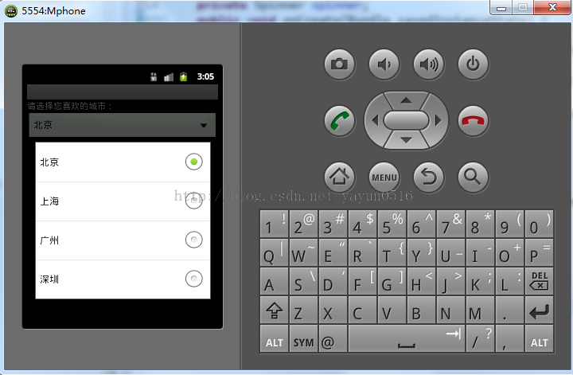
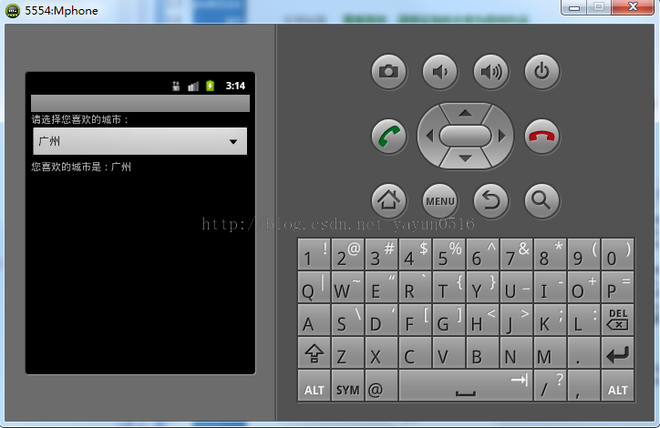

# 百战经典第二战-好玩的Spinner控件

下拉列表框是一种常见的图形组件，与其他选择组件相比，可以有效的节省屏幕空间，在Android中可以使用`android.widget.Spinner`类来实现。

下拉列表框中的列表项主要有以下两种配置方式。

**方式一**、通过资源文件配置，例如定义一个`values\city_data.xml`的文件，在定义数据内容时需要使用`<string-array>`元素指定，定义内容如下：

```
<?xml version="1.0" encoding="utf-8"?>  
<resources>  
    <string-array name="city_labels">  
        <item>北京 </item>  
        <item>上海 </item>  
        <item>广州 </item>  
        <item>深圳 </item>  
    </string-array>  
</resources>
```

**方式二**、通过`android.widget.ArrayAdapter`类读取资源文件或者指定具体的数据。

### 方式一实现

#### 定义main.xml文件

```
<?xml version="1.0" encoding="utf-8"?>  
<LinearLayout xmlns:android="http://schemas.android.com/apk/res/android"  
    android:layout_width="fill_parent"  
    android:layout_height="fill_parent"  
    android:orientation="vertical" >  
    <TextView  
        android:id="@+id/text"  
        android:layout_width="fill_parent"  
        android:layout_height="wrap_content"  
        android:text="请选择您喜欢的城市：" />  
    <Spinner  
        android:id="@+id/spinner"  
        android:layout_width="fill_parent"  
        android:layout_height="wrap_content"  
        android:entries="@array/city_labels" ><!-- 载入数据 -->  
    </Spinner>  
</LinearLayout>  
```

运行模拟器：



这时可以看到数据已经添加到Spinner中，我们发现这时的Spinner控件只是徒有其表，没有什么交互，下面实现交互，让代码更有趣。改动main.xml文件，添加一个TextView用于信息提示，一个TextView用于选择信息的显示。代码如下：

```
<?xml version="1.0" encoding="utf-8"?>  
<LinearLayout xmlns:android="http://schemas.android.com/apk/res/android"  
    android:layout_width="fill_parent"  
    android:layout_height="fill_parent"  
    android:orientation="vertical" >  
    <TextView  
        android:layout_width="fill_parent"  
        android:layout_height="wrap_content"  
        android:text="请选择您喜欢的城市：" />  
    <Spinner  
        android:id="@+id/spinner"  
        android:layout_width="fill_parent"  
        android:layout_height="wrap_content"  
        android:entries="@array/city_labels" > <!-- 载入数据 -->  
    </Spinner>  
    <TextView  
        android:id="@+id/text"  
        android:layout_width="fill_parent"  
        android:layout_height="wrap_content" />  
</LinearLayout>  
```

再次编辑 `MainActivity.java`，添加监听：

```
package org.yayun.demo;  
//省略导入包
public class MainActivity extends Activity {  
    private Spinner spinner;  
    private TextView textView;  
    public void onCreate(Bundle savedInstanceState) {  
        super.onCreate(savedInstanceState); // 生命周期方法  
        super.setContentView(R.layout.main); // 设置要使用的布局管理器  
        spinner = (Spinner) findViewById(R.id.spinner);  
        textView = (TextView) findViewById(R.id.text);  
        spinner.setOnItemSelectedListener(new OnItemSelectedListener() {  
            public void onItemSelected(AdapterView<?> parent, View view,  
                    int position, long id) {  
                String[] cities = getResources().getStringArray(  
                        R.array.city_labels);//获取列表数据  
                textView.setText("您喜欢的城市是：" + cities[position]);//显示选择项  
            }  
            public void onNothingSelected(AdapterView<?> parent) {  
                    //什么都没选触发
            }  
        });  
    }  
}  
```

实现了`OnItemSelectedListener`接口，并覆写了里面的`onItemSelected`方法，里面的position参数决定了单击的是哪一些，借助这个position就可以获取字符串数组中的字符串，将字符串信息通过TextView显示出来。
运行实例如下：



可以选择Spinner中的选项“广州”，选项将打印在TextView上，互动性就体现出来了，小实例也就有应用的价值了。

### 方式二实现

修改main.xml文件：

```
<?xml version="1.0" encoding="utf-8"?>  
<LinearLayout xmlns:android="http://schemas.android.com/apk/res/android"  
    android:layout_width="fill_parent"  
    android:layout_height="fill_parent"  
    android:orientation="vertical" >  
    <TextView  
        android:layout_width="fill_parent"  
        android:layout_height="wrap_content"  
        android:text="请选择您喜欢的城市：" />  
    <Spinner  
        android:id="@+id/spinner"  
        android:layout_width="fill_parent"  
        android:layout_height="wrap_content"  
        android:entries="@array/city_labels" > <!-- 载入数据 -->  
    </Spinner>  
    <TextView  
        android:id="@+id/text"  
        android:layout_width="fill_parent"  
        android:layout_height="wrap_content" />  
    <Spinner  
        android:id="@+id/spinnerCountry"  
        android:layout_width="fill_parent"  
        android:layout_height="wrap_content" > <!-- 动态载入数据 -->  
    </Spinner>  
</LinearLayout> 
```
MainActivity.java:

```
package org.yayun.demo;  
//省略导入包
public class MainActivity extends Activity {  
    private Spinner spinner, spinnerCountry;  
    private TextView textView;  
    private List<CharSequence> data = null;  
    private ArrayAdapter<CharSequence> adapter;  
    public void onCreate(Bundle savedInstanceState) {  
        super.onCreate(savedInstanceState); // 生命周期方法  
        super.setContentView(R.layout.main); // 设置要使用的布局管理器  
        spinner = (Spinner) findViewById(R.id.spinner);  
        textView = (TextView) findViewById(R.id.text);  
        spinnerCountry = (Spinner) findViewById(R.id.spinnerCountry);  
        spinnerCountry.setPrompt("选择国籍：");// 在列表中显示  
        data = new ArrayList<CharSequence>();  
        data.add("中國");  
        data.add("美國");  
        data.add("日本");  
        adapter = new ArrayAdapter<CharSequence>(this,  
                android.R.layout.simple_spinner_dropdown_item, this.data);//定义下拉列表  
        spinnerCountry.setAdapter(adapter);  
        spinner.setOnItemSelectedListener(new OnItemSelectedListener() {  
  
            public void onItemSelected(AdapterView<?> parent, View view,  
                    int position, long id) {  
                String[] cities = getResources().getStringArray(  
                        R.array.city_labels);// 获取列表数据  
                textView.setText("您喜欢的城市是：" + cities[position]);// 显示  
  
            }  
            public void onNothingSelected(AdapterView<?> parent) {  
            }  
        });  
        spinnerCountry.setOnItemSelectedListener(new OnItemSelectedListener() {  
            public void onItemSelected(AdapterView<?> parent, View view,  
                    int position, long id) {  
                String[] countries = data.toArray(new String[data.size()]);// 获取列表数据  
                Toast.makeText(MainActivity.this, "您的国籍是："+countries[position], Toast.LENGTH_SHORT).show();         
            }  
            public void onNothingSelected(AdapterView<?> parent) {        
            }  
        });  
    }  
} 
```

`setPrompt()`方法可以在下拉控件的上栏显示提示信息，就不用单独的TextView提示了。这里还用到了ArrayAdapter动态填充了第二个下拉控件的数据，更为灵活。

运行实例如下：


### 总结
 
1. 定义数据内容时需要使用`<string-array>`元素指定；
2. `android:entries="@array/city_labels"`载入文本资源；
3. `String[] cities = getResources().getStringArray(R.array.city_labels);//获取资源数据的方法`
4. String 和 CharSequence 关系
String 继承于CharSequence，也就是说String也是CharSequence类型。
CharSequence是一个接口，它只包括 `length()`, `charAt(int index)`, `subSequence(int start, int end)`这几个API接口。除了String实现了CharSequence之外，StringBuffer和StringBuilder也实现了CharSequence接口。
需要说明的是，CharSequence就是字符序列，String, StringBuilder和StringBuffer本质上都是通过字符数组实现的！
5. 提示信息的设置：`spinnerCountry.setPrompt("选择国籍：");// 在列表中显示`
6. 此外可以用`adapter.setDropDownViewResource(android.R.layout.simple_spinner_dropdown_item);//来设置显示风格`