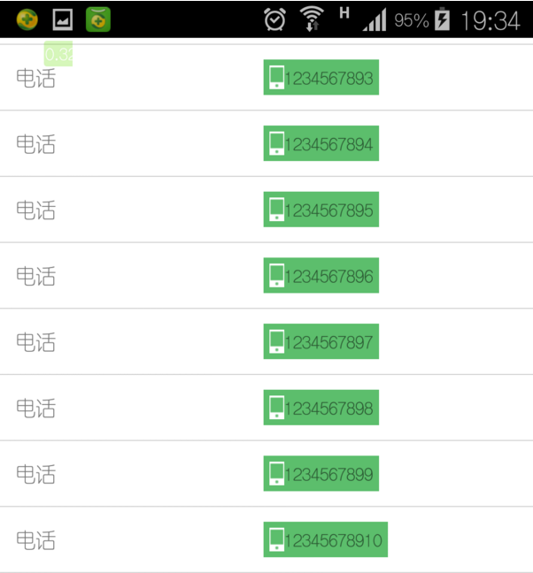

# 百战经典第二十战-ListView中点击button跳转到拨号界面实例

最近讨论了一个项目需求，在ListView的Item中放置了一个类似电话的图标，点击图标可以将号码调到拨号界面。实现起来很是容易，原理也易懂，较为实用，项目中有需要的可以直接引入。 
我模拟了一个简单的demo.代码如下： 

1.ListAdapter.java:

```
package com.example.listviewphone;
//省略import
public class ListAdapter extends BaseAdapter {
    private List<Test> tests;
    private Context context;
    LayoutInflater layoutInflater;
    public ListAdapter(Context context,List<Test> tests){
        this.tests=tests;
        this.context=context;       
        layoutInflater=LayoutInflater.from(context);
    }
    @Override
    public int getCount() {
        return tests.size();
    }
    @Override
    public Object getItem(int position) {
        return tests.get(position);
    }
    @Override
    public long getItemId(int position) {
        return position;
    }
    @Override
    public View getView(final int position, View convertView, ViewGroup parent) {
        ViewHolder viewHolder=null;
        if(convertView==null){
            viewHolder=new ViewHolder();
            convertView=layoutInflater.inflate(R.layout.item_list, null);
            viewHolder.mTitleLisTextView=(TextView)convertView.findViewById(R.id.tv_title_list);
            viewHolder.mPhoneTextView=(TextView)convertView.findViewById(R.id.tv_phone_list);
            convertView.setTag(viewHolder);
        }else {
            viewHolder=(ViewHolder) convertView.getTag();
        }     viewHolder.mTitleLisTextView.setText(tests.get(position).getTitle_lost());
        viewHolder.mPhoneTextView.setText(tests.get(position).getPhone_lost());
        viewHolder.mPhoneTextView.setOnClickListener(new OnClickListener() {
            @Override
            public void onClick(View v) {
                 // Intent intent = new Intent(Intent.ACTION_CALL,Uri.parse("tel:"+tests.get(position).getPhone_lost()));  //直接拨打电话，较为暴利，慎用！
                Intent intent = new Intent(Intent.ACTION_DIAL,Uri.parse("tel:"+tests.get(position).getPhone_lost()));  //跳转到用户界面较为温和，推荐使用！                   context.startActivity(intent);  
            }
        });
        return convertView;
    }
    class ViewHolder {
        private TextView mPhoneTextView;
        private TextView mTitleLisTextView;
        ViewHolder() {
        }
    }
}
```

ListAdapter 继承自BaseAdapter，构造方法传入上下文对象context和数据List-tests。覆写了getCount方法，返回数据个数，覆写了getItem返回指定下表对象，覆写了getItemId返回指定栏目下标。覆写了getView方法，返回view，在getView方法中实现了子栏目的单击事件监听，结合系统的Intent.ACTION_DIAL，进行电话功能的调取。

2.javabean—Test.java:

```
package com.example.listviewphone;
public class Test 
{
  private String content_test;
  private String phone_test;
  private String title_test;
  private String username;
public String getContent_test() {
    return content_test;
}
public void setContent_test(String content_test) {
    this.content_test = content_test;
}
public String getPhone_test() {
    return phone_test;
}
public void setPhone_test(String phone_test) {
    this.phone_test = phone_test;
}
public String getTitle_test() {
    return title_test;
}
public void setTitle_test(String title_test) {
    this.title_test = title_test;
}
public String getUsername() {
    return username;
}
public void setUsername(String username) {
    this.username = username;
}
}
```

为了便于操作，封装了Test类。

3.MainActivity.java:

```
package com.example.listviewphone;
//省略了import
public class MainActivity extends Activity {

    private ListView mListView;
    private ListAdapter adapter;
    private List<Test> tests;
    @Override
    protected void onCreate(Bundle savedInstanceState) {
        super.onCreate(savedInstanceState);
        requestWindowFeature(Window.FEATURE_NO_TITLE);
        setContentView(R.layout.activity_main);
        mListView=(ListView)findViewById(R.id.listview);
        initDatas();
        adapter=new ListAdapter(this, tests);
        mListView.setAdapter(adapter);
    }
    private void initDatas() {
        tests=new ArrayList<Test>();
        for (int i = 0; i < 30; i++) {
            Test test =new Test();
            test.setTitle_test("电话");
            test.setPhone_test("123456789"+i);
            tests.add(test);
        }
    }
}
```

下面是简单的两个布局文件： 

1.activity_main.xml:

```
<RelativeLayout xmlns:android="http://schemas.android.com/apk/res/android"
    xmlns:tools="http://schemas.android.com/tools"
    android:layout_width="match_parent"
    android:layout_height="match_parent" >
    <ListView
        android:id="@+id/listview"
        android:layout_width="match_parent"
        android:layout_height="wrap_content" />
</RelativeLayout>
```

2.item_list.xml:

```
<?xml version="1.0" encoding="utf-8"?>
<LinearLayout xmlns:android="http://schemas.android.com/apk/res/android"
    android:layout_width="match_parent"
    android:layout_height="wrap_content"
    android:padding="10dp"
    android:background="#ffffff"
    android:orientation="horizontal" >
    <TextView
        android:id="@+id/tv_title_list"
        android:layout_width="wrap_content"
        android:layout_height="wrap_content"
        android:text="电话"
        android:singleLine="true"
        >
    </TextView>
    <TextView
        android:id="@+id/tv_phone_list"

        android:textSize="12sp"
       android:layout_height="wrap_content"
       android:layout_width="wrap_content"
        android:background="@color/green"
        android:text="138024249542"
        android:padding="4dp"
        android:layout_marginLeft="140dp"
        android:drawableLeft="@drawable/icon_photo" >
    </TextView>
</LinearLayout>
```

运行实例如下：



点击一个：


成功跳转到拨号界面，并将对应的电话号码传了过来。