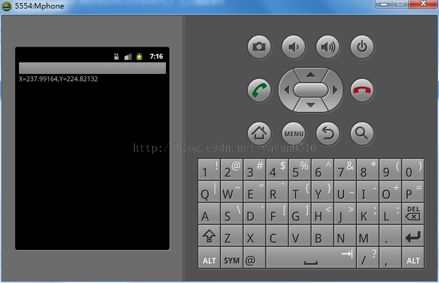
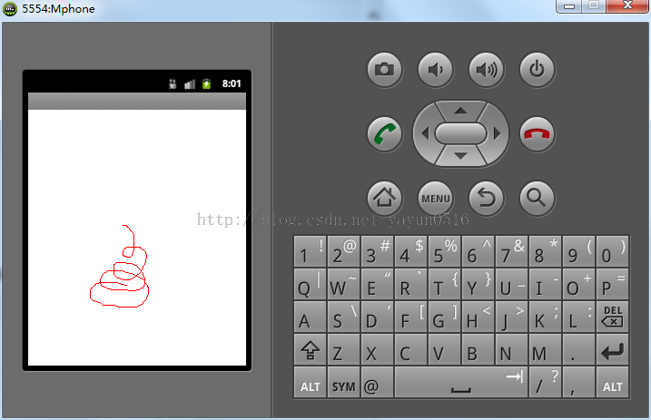

# 百战经典第三战-实现画图板

解触摸事件（OnTouchListener）指的是当用户接触到屏幕之后所触发的一种事件形式，用户触摸屏幕时，可以使用触摸事件监听取得用户当前的坐标。

### 一、坐标显示

在实现画图功能之前，先实现利用触摸事件监听获得当前触摸的坐标。

**main.xml**：

```
<?xml version="1.0" encoding="utf-8"?>  
<LinearLayout xmlns:android="http://schemas.android.com/apk/res/android"  
    android:layout_width="fill_parent"  
    android:layout_height="fill_parent"  
    android:orientation="vertical" >  
    <TextView  
        android:id="@+id/text"  
        android:layout_width="fill_parent"  
        android:layout_height="fill_parent" />  
</LinearLayout> 
```

布局代码非常简单，只引入一个TextView控件，用于记录当前左边。

下面看一下MainActivity代码：

```
package org.yayun.demo;  
  //省略导入包
public class MainActivity extends Activity {  
    private TextView textView;  
    public void onCreate(Bundle savedInstanceState) {  
        super.onCreate(savedInstanceState); // 生命周期方法  
        super.setContentView(R.layout.main); // 设置要使用的布局管理器  
    textView=(TextView)findViewById(R.id.text);  
    textView.setOnTouchListener(new OnTouchListener() {//触摸事件  
        public boolean onTouch(View v, MotionEvent event) {  
            textView.setText("X="+event.getX()+",Y="+event.getY());//获取坐标  
            return false;  
        }  
    });  
    }  
}  
```

实现了触摸监听，结合MotionEvent的getX和getY方法获取当前坐标值。

运行实例：



### 二、实现画图功能

由于OnTouch事件是在View类中定义的，所以如果想要完成绘图的操作，首先应该定义一个属于自己的组件，该组件专门进行绘图板的功能实现，而且组件类一定要继承View类，同时要覆写View类的`onDraw()`绘图方法。
代码如下：

```
package org.yayun.demo;  
  //省略导入包  
public class MyPaintView extends View{  
    private List<Point> allPoints=new ArrayList<Point>();//保存所有的坐标点  
    public MyPaintView(Context context, AttributeSet attrs) {  
        super(context, attrs);  
        super.setBackgroundColor(Color.WHITE);  
        super.setOnTouchListener(new OnTouchListener() {  
            public boolean onTouch(View v, MotionEvent event) {  
                Point point=new Point((int)event.getX(),(int)event.getY());  
                if(event.getAction()==MotionEvent.ACTION_DOWN){//判断按下  
                    allPoints=new ArrayList<Point>();//开始新的记录  
                    allPoints.add(point);  
                }else if(event.getAction()==MotionEvent.ACTION_UP){  
                    allPoints.add(point);  
                }else if(event.getAction()==MotionEvent.ACTION_MOVE){  
                    allPoints.add(point);  
                    MyPaintView.this.postInvalidate();//重绘  
                }  
                return true;//表示下面的不再执行了  
            }  
        });  
    }   
    @Override  
    protected void onDraw(Canvas canvas) {  
        Paint paint=new Paint();  
        paint.setColor(Color.RED);  
        if(allPoints.size()>1){  
            Iterator<Point> iterator=allPoints.iterator();  
            Point firstPoint=null;//开始点  
            Point lastpPoint=null;//结束点  
            while (iterator.hasNext()) {  
                if(firstPoint==null){//找到开始点  
                    firstPoint=(Point)iterator.next();  
                }else{  
                    if(lastpPoint!=null){  
                        firstPoint=lastpPoint;  
                    }  
                    lastpPoint=(Point)iterator.next();  
                    canvas.drawLine(firstPoint.x, firstPoint.y, lastpPoint.x, lastpPoint.y, paint);//画线  
                }    
            }  
        }  
        super.onDraw(canvas);  
    }  
} 
```

这里用到了自定义控件，继承View类。定义了一个泛型Point的List用于保存所有的坐标数据，在绘图 `onDraw()`方法时，根据这些坐标划线。

修改main.xml，将自定义控件MyPaintView引入：

```
<?xml version="1.0" encoding="utf-8"?>  
<LinearLayout xmlns:android="http://schemas.android.com/apk/res/android"  
    android:layout_width="fill_parent"  
    android:layout_height="fill_parent"  
    android:orientation="vertical" >  
    <org.yayun.demo.MyPaintView  
        android:id="@+id/paintView"  
        android:layout_width="fill_parent"  
        android:layout_height="fill_parent" >  
    </org.yayun.demo.MyPaintView>  
</LinearLayout> 
```

MainActivity不用加入任何东西：

```
package org.yayun.demo;  
//省略导入包
public class MainActivity extends Activity {  
    public void onCreate(Bundle savedInstanceState) {  
        super.onCreate(savedInstanceState); // 生命周期方法  
        super.setContentView(R.layout.main); // 设置要使用的布局管理器  
    }  
} 
```

运行实例，在实例上用手指就可以作画了，如下：



### 总结

1. 触摸事件`OnTouchListener`及`onTouch()`方法；
2. `event.getX()`//利用MotionEvent获取坐标的方法getX()
3. `onDraw()`方法和如何使用Canvas进行绘图的操作，而本次绘制是一条线（`canvas.drawLine()`）。