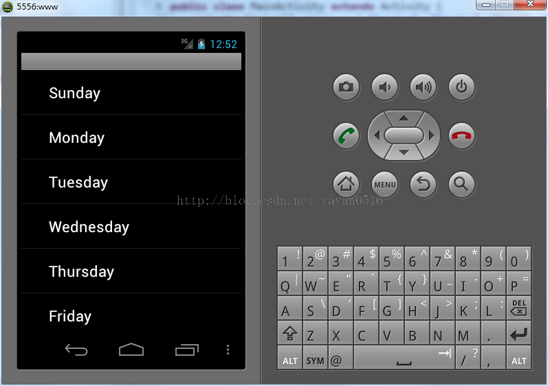
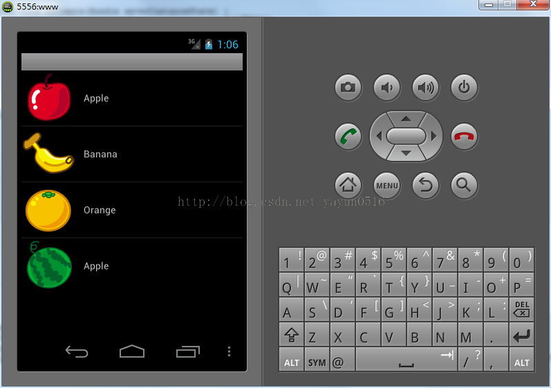
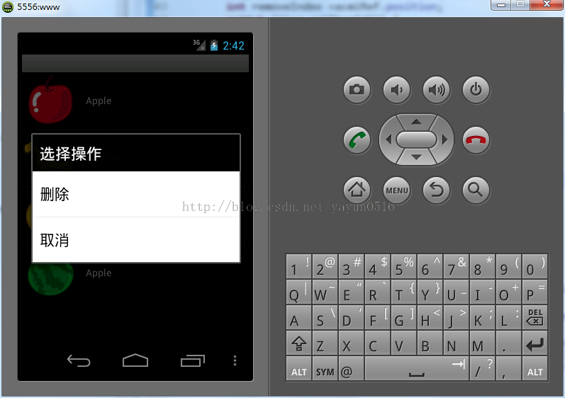
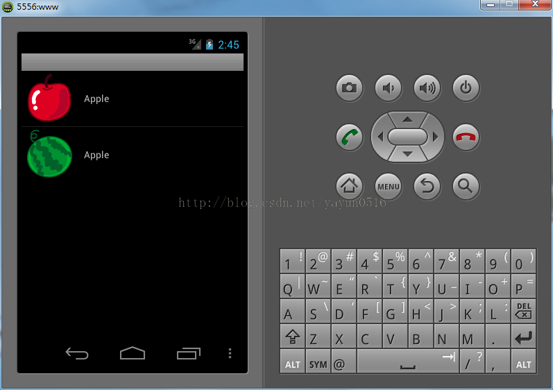

# 百战经典第四战-玩转ListView

Android用的最多的，也最难用的应该就是ListView了，ListView的继承结构如下：

```
java.lang.Object
   ↳	android.view.View
 	   ↳	android.view.ViewGroup
 	 	   ↳	android.widget.AdapterView<T extends android.widget.Adapter>
 	 	 	   ↳	android.widget.AbsListView
 	 	 	 	   ↳	android.widget.ListView
```

listview 三元素：

列表的显示需要三个元素：

1. ListVeiw 用来展示列表的View。
2. 适配器 用来把数据映射到ListView上的中介。
3. 数据    具体的将被映射的字符串，图片，或者基本组件。

根据列表的适配器类型，列表分为三种，ArrayAdapter，SimpleAdapter和SimpleCursorAdapter

其中以ArrayAdapter最为简单，只能展示一行字。SimpleAdapter有最好的扩充性，可以自定义出各种效果。SimpleCursorAdapter可以认为是SimpleAdapter对数据库的简单结合，可以方面的把数据库的内容以列表的形式展示出来。

### 一、最简单的ListView

首先简单介绍一下ListView的最简单用法，不用列表项布局文件：

```
package org.yayun.demo;  
//省略导入包
public class MainActivity extends Activity {  
    private String[] arrays = { "Sunday", "Monday", "Tuesday", "Wednesday",  
            "Thursday", "Friday", "Saturday" };  
    private ListView listView;  
    @Override  
    protected void onCreate(Bundle savedInstanceState) {  
        super.onCreate(savedInstanceState);  
        listView = new ListView(this);  
        listView.setAdapter(new ArrayAdapter<String>(this,  
                android.R.layout.simple_expandable_list_item_1, arrays));//利用ArrayAdapter对数据进行包装  
        super.setContentView(listView);//将ListView设置为显示界面  
    }  
}
```

这里使用了ArrayAdapter实现，直接将arrays中的数据引入ListView，满足简单的应用需求。

实例运行如下：



### 二、结合ArrayAdapter实现较复杂的ListView

1.main.xml代码：

```
<?xml version="1.0" encoding="utf-8"?>
<LinearLayout xmlns:android="http://schemas.android.com/apk/res/android"
    android:layout_width="fill_parent"
    android:layout_height="fill_parent"
    android:orientation="vertical" >
    <ListView
        android:id="@+id/list_view"
        android:layout_width="fill_parent"
        android:layout_height="wrap_content" />
</LinearLayout>
```

2.fruit_item.xml代码：（ListView中的单项目）

```
<?xml version="1.0" encoding="utf-8"?>  
<LinearLayout xmlns:android="http://schemas.android.com/apk/res/android"  
    android:layout_width="fill_parent"  
    android:layout_height="fill_parent">  
    <ImageView  
        android:id="@+id/fruit_image"  
        android:layout_width="wrap_content"  
        android:layout_height="wrap_content" />  
    <TextView  
        android:id="@+id/fruit_name"  
        android:layout_width="wrap_content"  
        android:layout_height="wrap_content"  
        android:layout_gravity="center"  
        android:layout_marginLeft="10sp" />  
</LinearLayout> 
```

3.Fruit.java代码如下：（封装属性）

```
package org.yayun.demo;  
  
public class Fruit {  
    private String name;  
    private int imageId;  
    public Fruit(String name, int imageId) {  
        this.name = name;  
        this.imageId = imageId;  
    }  
    public String getName() {  
        return name;  
    }  
    public int getImageId() {  
        return imageId;  
    }  
} 
```

4.集成ArrayAdapter的FruitAdapter.java代码如下：（适配器类）

```
package org.yayun.demo;  
//省略导入包
public class FruitAdapter extends ArrayAdapter<Fruit> {  
    private int resourceId;  
    public FruitAdapter(Context context, int textViewResourceId,  
            List<Fruit> objects) {  
        super(context, textViewResourceId, objects);  
        resourceId = textViewResourceId;  
    }  
    @Override  
    public View getView(int position, View convertView, ViewGroup parent) {  
        Fruit fruit = getItem(position);  
        View view;  
        ViewHolder viewHolder;  
        if (convertView == null) {  
            view = LayoutInflater.from(getContext()).inflate(resourceId, null);  
            viewHolder = new ViewHolder();  
            viewHolder.fruitImage = (ImageView) view  
                    .findViewById(R.id.fruit_image);  
            viewHolder.fruitName = (TextView) view  
                    .findViewById(R.id.fruit_name);  
            view.setTag(viewHolder);  
        } else {  
            view = convertView;  
            viewHolder = (ViewHolder) view.getTag();  
        }  
        viewHolder.fruitImage.setImageResource(fruit.getImageId());  
        viewHolder.fruitName.setText(fruit.getName());  
        return view;  
    }  
    class ViewHolder {  
        ImageView fruitImage;  
        TextView fruitName;  
    }  
}  
```

对代码不熟悉的同学不要紧张，这些都是较为固定的写法，写多了就可以理解其中的含义了。

5.MainActivity.java代码如下：

```
package org.yayun.demo;  
//省略导入包
public class Hello extends Activity {  
    private List<Fruit> fruitList = new ArrayList<Fruit>();  
  
    public void onCreate(Bundle savedInstanceState) {  
        super.onCreate(savedInstanceState); // 生命周期方法  
        super.setContentView(R.layout.main); // 设置要使用的布局管理器  
        initFruits();  
        FruitAdapter adapter = new FruitAdapter(Hello.this,  
                R.layout.fruit_item, fruitList);  //适配器
        ListView listView = (ListView) findViewById(R.id.list_view);  
        listView.setAdapter(adapter);  //设置适配器
    }  
  
    private void initFruits() {  //数据初始化
        Fruit appleFruit = new Fruit("Apple", R.drawable.apple_pic);  
        fruitList.add(appleFruit);  
        Fruit bananaFruit = new Fruit("Banana", R.drawable.banana_pic);  
        fruitList.add(bananaFruit);  
        Fruit orangeFruit = new Fruit("Orange", R.drawable.orange_pic);  
        fruitList.add(orangeFruit);  
        Fruit waterFruit = new Fruit("Apple", R.drawable.watermelon_pic);  
        fruitList.add(waterFruit);  
    }  
}  
```

运行上面的实例，使得ListView不仅可以显示文字，也可以显示图片，进行组合显示。



### 三、结合上下文菜单实现单项的删除

修改MainActivity.java程序如下：

```
package org.yayun.demo;  
//省略导入包
public class Hello extends Activity {  
    private List<Fruit> fruitList = new ArrayList<Fruit>();  
    FruitAdapter adapter;  
    public void onCreate(Bundle savedInstanceState) {  
        super.onCreate(savedInstanceState); // 生命周期方法  
        super.setContentView(R.layout.main); // 设置要使用的布局管理器  
        initFruits();  
        adapter = new FruitAdapter(Hello.this, R.layout.fruit_item, fruitList);  
        ListView listView = (ListView) findViewById(R.id.list_view);  
        listView.setAdapter(adapter);  
        super.registerForContextMenu(listView);//注册上下文菜单  
    }  
    @Override  
    public void onCreateContextMenu(ContextMenu menu, View v,// 创建菜单项  
            ContextMenuInfo menuInfo) {  
        super.onCreateContextMenu(menu, v, menuInfo);  
        menu.setHeaderTitle("选择操作");  
        menu.add(Menu.NONE, Menu.FIRST + 1, 1, "删除");  
        menu.add(Menu.NONE, Menu.FIRST + 2, 2, "取消");  
    }  
    @Override  
    public boolean onContextItemSelected(MenuItem item) {// 选择监听  
        AdapterContextMenuInfo acmiRef = (AdapterContextMenuInfo) item  
                .getMenuInfo();// 用来获取item信息哎，重要  
        int removeIndex = acmiRef.position;  
        switch (item.getItemId()) {  
        case Menu.FIRST + 1:  
            fruitList.remove(removeIndex);  
            adapter.notifyDataSetChanged();// 删除后刷新ListView  
              break;  
        case Menu.FIRST + 2:  
            break;  
        default:  
            break;  
        }  
        return false;  
    }  
    private void initFruits() {  //初始化数据
        Fruit appleFruit = new Fruit("Apple", R.drawable.apple_pic);  
        fruitList.add(appleFruit);  
        Fruit bananaFruit = new Fruit("Banana", R.drawable.banana_pic);  
        fruitList.add(bananaFruit);  
        Fruit orangeFruit = new Fruit("Orange", R.drawable.orange_pic);  
        fruitList.add(orangeFruit);  
        Fruit waterFruit = new Fruit("Apple", R.drawable.watermelon_pic);  
        fruitList.add(waterFruit);  
    }  
} 
```

运行实例如下：



点击删除按钮后：



### 总结

1. `super.registerForContextMenu(listView);`//注册上下文菜单
2. `adapter.notifyDataSetChanged();`// 删除后刷新ListView
3. `AdapterContextMenuInfo acmiRef = (AdapterContextMenuInfo) item.getMenuInfo();`// 用来获取当前item信息，重要
   `int removeIndex = acmiRef.position;`//获取点击位置的坐标