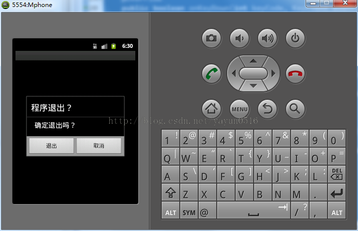
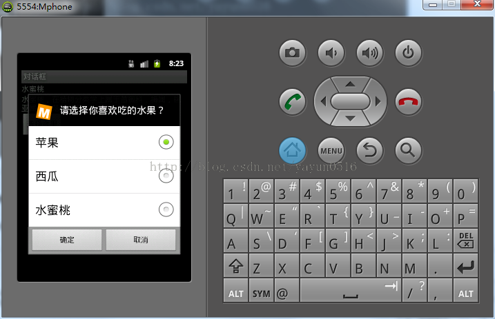
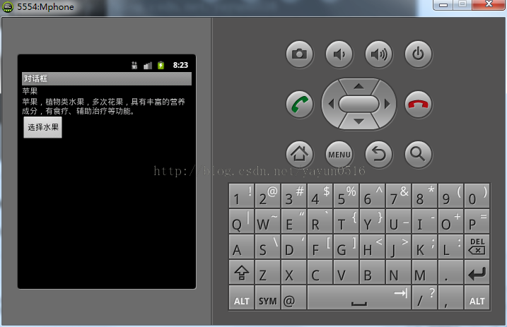
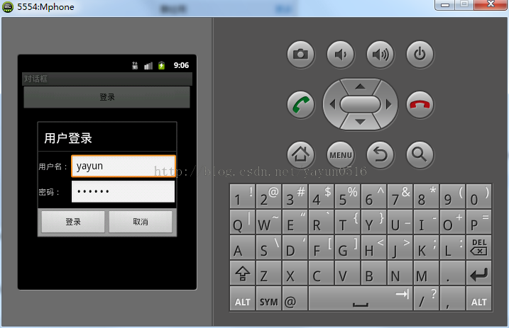
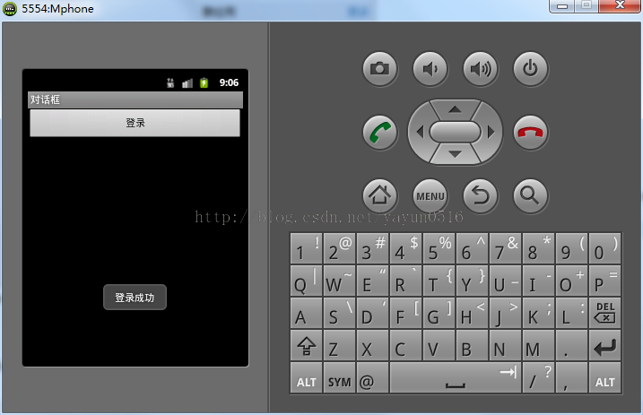
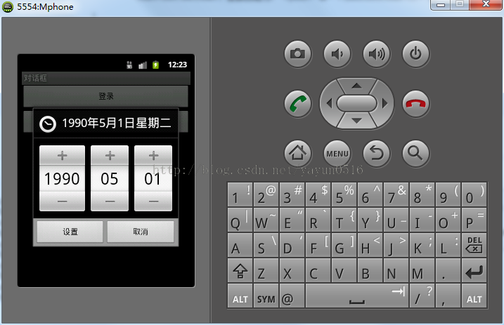
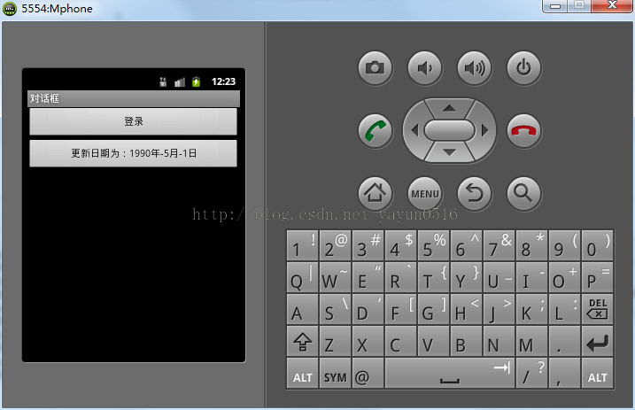
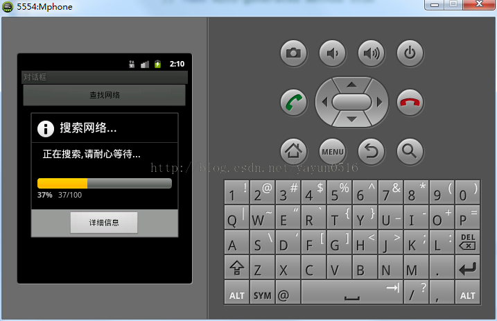

# 百战经典第五战-各种对话框Dialog精彩荟萃

在图形界面中，对话框是人机交互的一种重要形式，程序可以通过对话框进行一些信息的提示，而用户也可以通过对话框对程序进行一些简单的交互操作。

在Android中，所有的对话框都是从android.app.Dialog类继承而来的，此类的继承结构如下：

```
java.lang.Object
   android.app.Dialog
```

可以发现此类直接继承自Object类，与View类没有任何继承关系。

###  一、AlertDialog和AlertDialog.Builder

警告框（AlertDialog）是项目中最常见的对话框形式，是Dialog的直接子类。

如果想要实例化AlertDialog类，往往需要依靠其内部类AlertDialog.Builder类完成。

下面通过一个最常见的返回键提示退出功能来演示一下其用法。

1. 布局文件main.xml，这里只用到返回键，所以布局文件可以不设置任何控件。
2. MainActivity.java：

```
package org.yayun.demo;  
//省略导入包 
public class MainActivity extends Activity {    
    public void onCreate(Bundle savedInstanceState) {  
        super.onCreate(savedInstanceState); // 生命周期方法  
        super.setContentView(R.layout.main); // 设置要使用的布局管理器  
    }  
    @Override  
    public boolean onKeyDown(int keyCode, KeyEvent event) {  
        if(keyCode==KeyEvent.KEYCODE_BACK){  
            this.exitDialog();  
        }  
        return super.onKeyDown(keyCode, event);  
    }  
    private void exitDialog() {  
        Dialog dialog=new AlertDialog.Builder(this).setTitle("程序退出？").setMessage("确定退出吗？").setPositiveButton("退出", new OnClickListener() {  
            public void onClick(DialogInterface dialog, int which) {  
                MainActivity.this.finish();      
            }  
        }).setNegativeButton("取消", new OnClickListener() {     
            public void onClick(DialogInterface dialog, int which) {       
            }  
        }).create();//创建Dialog  
        dialog.show();//显示对话框   
    }  
} 
```

这里覆写了`onKeyDown()`方法，通过里面的keycode参数判断当前按下的键，若`keyCode==KeyEvent.KEYCODE_BACK`可以认定按下了返回键，弹出对话框进行提示，若选择了positivebutton（退出）则执行finish方法，退出应用。

运行实例如下：



这属于比较简单的应用，但是在实际开发中用到还比较多。

### 二、类似ListView的显示风格的选项列表

1.main.xml代码如下：

```
<?xml version="1.0" encoding="utf-8"?>  
<LinearLayout xmlns:android="http://schemas.android.com/apk/res/android"  
    android:orientation="vertical" android:layout_width="fill_parent"  
    android:layout_height="fill_parent">  
    <TextView  
        android:id="@+id/mych"  
        android:text=""  
        android:layout_width="wrap_content"  
        android:layout_height="wrap_content" />  
    <TextView  
        android:id="@+id/mytext"  
        android:text=""  
        android:layout_width="wrap_content"  
        android:layout_height="wrap_content" />  
    <Button   
        android:id="@+id/mybut"  
        android:text="选择水果"  
        android:layout_width="wrap_content"   
        android:layout_height="wrap_content"/>  
</LinearLayout> 
```

2.MainActivity.java如下：

```
package org.yayun.demo;  
//省略导入包
public class MyDialogDemo extends Activity {  
    private Button mybut = null ;   // 定义按钮  
    private TextView mych = null ;  // 定义文本  
    private TextView mytext = null ;    // 定义文本  
    private String fruitData [] = new String[] { "苹果", "西瓜", "水蜜桃" };  
    private String fruitDesc [] = new String[] {  
            "苹果，植物类水果，多次花果，具有丰富的营养成分，有食疗、辅助治疗等功能。",  
            "西瓜（学名：Citrullus Lanatus，英文：Watermelon），属葫芦科，原产于非洲。",  
            "水蜜桃，在植物分类学上属于蔷薇科，梅属，桃亚属，为落叶小乔木。"} ;  
    private int chNum = 0 ; // 保存选项  
    @Override   
    public void onCreate(Bundle savedInstanceState) {  
        super.onCreate(savedInstanceState);  
        super.setContentView(R.layout.main); // 调用布局管理器  
        this.mybut = (Button) super.findViewById(R.id.mybut) ;  // 取得按钮  
        this.mych = (TextView) super.findViewById(R.id.mych) ;  // 取得文本  
        this.mytext = (TextView) super.findViewById(R.id.mytext) ;  // 取得文本  
        this.mybut.setOnClickListener(new OnClickListenerImpl()) ;  // 设置事件类  
    }  
    private class OnClickListenerImpl implements OnClickListener {  
        @Override  
        public void onClick(View view) {  
            Dialog dialog = new AlertDialog.Builder(MyDialogDemo.this)  
                .setIcon(R.drawable.pic_m)   
                .setTitle("请选择你喜欢吃的水果？")  
                .setPositiveButton("确定", new DialogInterface.OnClickListener() {  
                      
                    @Override  
                    public void onClick(DialogInterface dialog, int which) {  
                                    MyDialogDemo.this.mych  
                                            .setText(MyDialogDemo.this.fruitData[MyDialogDemo.this.chNum]); // 设置选项的名称  
                    }  
                })  
                .setNegativeButton("取消", new DialogInterface.OnClickListener() {  
                    @Override  
                    public void onClick(DialogInterface dialog, int which) {  
                          
                    }  
                }).setSingleChoiceItems(MyDialogDemo.this.fruitData, 0, new DialogInterface.OnClickListener() {//setSingleChoiceItems()方法  
                    @Override  
                    public void onClick(DialogInterface dialog, int which) {  
                                    MyDialogDemo.this.mytext  
                                            .setText(MyDialogDemo.this.fruitDesc[which]);  
                                    MyDialogDemo.this.chNum = which ;   // 保存选项的索引  
                    }  
                }).create() ;  
            dialog.show() ;  
        }        
    }  
} 
```

这种显示风格用到setSingleChoiceItems()方法，其覆写的onClick()方法中的参数which决定了当前选择的是哪一项。

运行实例：





### 三、定制对话框和LayoutInflater

之前的对话框都是直接通过Activity程序进行定义的，但是如果希望在对话框中显示一些复杂的界面，例如编写一个登陆提示对话框，就需要通过布局文件定义显示组件，之后再将这些布局显示引入到对话框中，而如果想要引入，则需要LayoutInflater类的支持。
1定义布局管理器main.xml：

```
<?xml version="1.0" encoding="utf-8"?>  
<LinearLayout xmlns:android="http://schemas.android.com/apk/res/android"  
    android:layout_width="fill_parent"  
    android:layout_height="fill_parent"  
    android:orientation="vertical" >  
    <Button  
        android:id="@+id/mybut"  
        android:layout_width="fill_parent"  
        android:layout_height="wrap_content"  
        android:text="登录" />  
</LinearLayout>  
```

主布局文件很简单，只有一个Button 控件，点击button控件弹出登录框。

2.定义对话框所需的布局管理器login.xml:

```
<?xml version="1.0" encoding="utf-8"?>  
<LinearLayout xmlns:android="http://schemas.android.com/apk/res/android"  
    android:layout_width="fill_parent"  
    android:layout_height="fill_parent"  
    android:orientation="vertical" >   
<LinearLayout   
    android:layout_width="fill_parent"  
    android:layout_height="wrap_content"  
    android:orientation="horizontal" >  
     <TextView  
        android:layout_width="60dp"  
        android:layout_height="wrap_content"  
        android:layout_weight="1"  
        android:text="用户名：" />  
      <EditText  
        android:id="@+id/edit_user"  
        android:layout_width="wrap_content"  
        android:layout_height="wrap_content"  
        android:layout_weight="88"  
        android:text="yayun" />  
</LinearLayout>  
<LinearLayout   
    android:layout_width="fill_parent"  
    android:layout_height="wrap_content"  
    android:orientation="horizontal" >  
     <TextView  
        android:layout_width="60dp"  
        android:layout_height="wrap_content"  
        android:layout_weight="1"  
        android:text="密码：" />  
      <EditText  
        android:id="@+id/edit_passwd"  
        android:layout_width="wrap_content"  
        android:layout_height="wrap_content"  
        android:layout_weight="88"  
        android:password="true"  
        android:text="123456" />     
</LinearLayout>  
</LinearLayout>
```

3.定义MainActivity.java:

```
package org.yayun.demo;  
//省略导入包
public class MyDialogDemo extends Activity {  
    private Button btn;  
    String string_userString;  
    String string_passwdString;     
    @Override   
    public void onCreate(Bundle savedInstanceState) {  
        super.onCreate(savedInstanceState);  
        super.setContentView(R.layout.main); // 调用布局管理器  
        btn=(Button)findViewById(R.id.mybut);  
        btn.setOnClickListener(new OnClickListenerImpl());        
    }  
    private class OnClickListenerImpl implements OnClickListener{  
        @Override  
        public void onClick(View v) {  
            LayoutInflater layoutInflater=LayoutInflater.from(MyDialogDemo.this);//获得layoutInflater对象  
            View view=layoutInflater.from(MyDialogDemo.this).inflate(R.layout.login, null);//获得view对象  
            EditText edit_user=(EditText)view.findViewById(R.id.edit_user);//获取控件  
            EditText edit_passwd=(EditText)view.findViewById(R.id.edit_passwd);  
             string_userString=edit_user.getText().toString();  
             string_passwdString=edit_passwd.getText().toString();  
            Dialog dialog=new AlertDialog.Builder(MyDialogDemo.this).setTitle("用户登录").setView(view).setPositiveButton("登录", new DialogInterface.OnClickListener() {   
                public void onClick(DialogInterface dialog, int which) {  
       if(string_userString.equals("yayun")&&string_passwdString.equals("123456")){  
                        Toast.makeText(MyDialogDemo.this, "登录成功", Toast.LENGTH_SHORT).show();  
                    }else{  
                        Toast.makeText(MyDialogDemo.this, "登录失败", Toast.LENGTH_SHORT).show();  
                    }        
                }  
            }).setNegativeButton("取消", new DialogInterface.OnClickListener() {      
                @Override  
                public void onClick(DialogInterface dialog, int which) {  
                    // 取消按钮事件   
                }  
            }).create();  
            dialog.show();  
        }         
    }   
}
```

调用LayoutInflater的from方法获取对象，这里LayoutInflater应该采用了单例模式，然后调用其inflate()方法获取view对象。通过view对象的findViewById()方法获取两个控件对象，通过这两个控件对象获取相关数值，进行逻辑判断登录是否成功。

4.运行实例：




### 四、日期对话框（DatePickerDialog）和时间对话框（TimePickerDialog）

主要进行日期和时间的设置。

1.main.xml代码如下：

```
<?xml version="1.0" encoding="utf-8"?>  
<LinearLayout xmlns:android="http://schemas.android.com/apk/res/android"  
    android:layout_width="fill_parent"  
    android:layout_height="fill_parent"  
    android:orientation="vertical" >  
    <Button  
        android:id="@+id/mybut"  
        android:layout_width="fill_parent"  
        android:layout_height="wrap_content"  
        android:text="设置日期" />  
    <Button  
        android:id="@+id/mytext"  
        android:layout_width="fill_parent"  
        android:layout_height="wrap_content"  
        android:text="" />  
</LinearLayout>  
```
2.MainActivity.java代码如下：

```
package org.yayun.demo;  
//省略导入包
public class MyDialogDemo extends Activity {  
    private Button btn;  
    private TextView textView;       
    @Override   
    public void onCreate(Bundle savedInstanceState) {  
        super.onCreate(savedInstanceState);  
        super.setContentView(R.layout.main); // 调用布局管理器  
        btn=(Button)findViewById(R.id.mybut);  
        textView=(TextView)findViewById(R.id.mytext);  
        btn.setOnClickListener(new OnClickListenerImpl());        
    }  
    private class OnClickListenerImpl implements OnClickListener{  
        @Override  
        public void onClick(View v) {  
            Dialog dialog=new DatePickerDialog(MyDialogDemo.this, new DatePickerDialog.OnDateSetListener() {         
                @Override  
                public void onDateSet(DatePicker view, int year, int monthOfYear,  
                        int dayOfMonth) {  
                    textView.setText("更新日期为："+year+"年-"+(monthOfYear+1)+"月-"+dayOfMonth+"日");        
                }  
            }, 1990, 04, 01);  
            dialog.show();     
        }    
    }  
}  
```

实现了DatePickerDialog，并覆写了`onDateSet()`方法，通过里面的year、monthOfYear和dayOfMonth参数获得了更新后的年月日信息。

运行实例：




TimePickerDialog对话框和DatePickerDialog对话框基本一样。

### 五、进度条对话框

先看一个简单的圈形进度处理对话框，这个在开发中也十分常见，常用于登录等待、网络连接等待、数据刷新等待等，可以增加用户友好度。

1.main.xml代码如下：

```
<?xml version="1.0" encoding="utf-8"?>  
<LinearLayout xmlns:android="http://schemas.android.com/apk/res/android"  
    android:layout_width="fill_parent"  
    android:layout_height="fill_parent"  
    android:orientation="vertical" >  
    <Button  
        android:id="@+id/mybut"  
        android:layout_width="fill_parent"  
        android:layout_height="wrap_content"  
        android:text="查找网络" />  
</LinearLayout>  
```

2.MainActivity.java代码如下：

```
package org.yayun.demo;  
//省略导入包
public class MyDialogDemo extends Activity {  
    private Button btn;  
    @Override  
    public void onCreate(Bundle savedInstanceState) {  
        super.onCreate(savedInstanceState);  
        super.setContentView(R.layout.main); // 调用布局管理器  
        btn = (Button) findViewById(R.id.mybut);  
        btn.setOnClickListener(new OnClickListenerImpl());  
    }  
    private class OnClickListenerImpl implements OnClickListener {  
        @Override  
        public void onClick(View v) {  
            final ProgressDialog dialog = ProgressDialog.show(  
                    MyDialogDemo.this, "请搜索网络...", "请耐心等待...");// 之所以用final定义，主要目的是为了让内部类可以访问方法中定义的参数。  
            new Thread() {  
                public void run() {  
                    try {  
                        Thread.sleep(3000);  
                    } catch (InterruptedException e) {   
                        e.printStackTrace();  
                    } finally {  
                        dialog.dismiss();  
                    }  
                };  
            }.start();  
        }  
    }  
}  
```

实现了ProgressDialog，在内部定义了一个线程用于模仿网络请求。

运行实例：



### 总结

1. 如果想要实例化AlertDialog类，往往需要依靠其内部类AlertDialog.Builder类完成；
2. 判断是否是返回键：`keyCode==KeyEvent.KEYCODE_BACK`；
3. `setSingleChoiceItems()`方法的使用；
4. LayoutInflater类引入布局文件，`LayoutInflater layoutInflater=LayoutInflater.from(MyDialogDemo.this);`//获得layoutInflater对象`View view=layoutInflater.from(MyDialogDemo.this).inflate(R.layout.login, null);`//获得view对象；
5. Dialog 的`setView()`方法，设置显示布局；
6. 日期对话框（DatePickerDialog）和时间对话框（TimePickerDialog）；
7. ProgressDialog的`setProgressStyle()`方法设置等待对话框显示样式，`incrementProgressBy()`启动自增长。