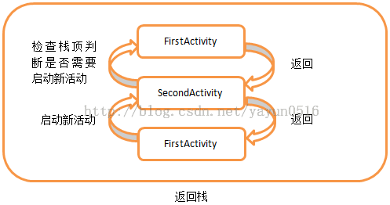
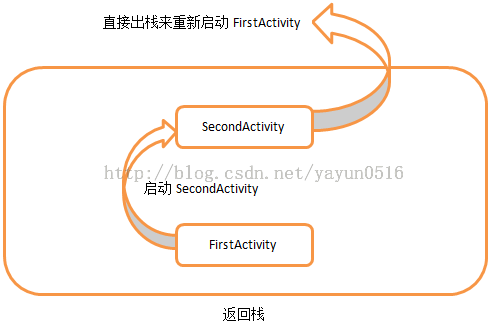
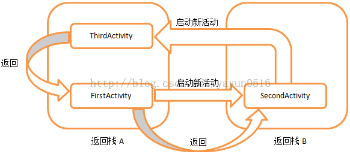

# 百战经典第六战-Activity启动模式小样

在介绍四种启动模式之前，先介绍一下Task栈的相关知识，task是一个具有栈结构的容器，可以放置多个Activity实例。

启动一个应用，系统就会为之创建一个task，来放置根Activity；默认情况下，一个Activity启动另一个Activity时，两个Activity是放置在同一个task中的，后者被压入前者所在的task栈，当用户按下后退键，后者从task被弹出，前者又显示在幕前，特别是启动其他应用中的Activity时，两个Activity对用户来说就好像是属于同一个应用；系统task和task之间是互相独立的，当我们运行一个应用时，按下Home键回到主屏，启动另一个应用，这个过程中，之前的task被转移到后台，新的task被转移到前台，其根Activity也会显示到幕前，过了一会之后，在此按下Home键回到主屏，再选择之前的应用，之前的task会被转移到前台，系统仍然保留着task内的所有Activity实例，而那个新的task会被转移到后台，如果这时用户再做后退等动作，就是针对该task内部进行操作了。本部分内容在Android面试中经常会被问到，作为一个Android开发者必须对这些启动模式有一定的了解，开发中也时常会用到。

下面介绍一下Activity的启动模式，一共有四种：standard、singleTop、singleTask、singleInstance，可以在AndroidManifest.xml文件中通过给`<activity>`标签指定`android:launchMode`属性来选择启动模式，下面来逐个研究。

### 一、standard模式

standard是默认启动方式，不进行设置的话所有活动会自动使用这种模式。Android使用Task栈来管理活动的，在本模式下，每当启动一个新的活动，它就会在Task栈中入栈，并处于栈顶位置。对于该模式下，系统不会在乎是否这个活动已经在栈中，每次启动都会创建该活动的一个新的实例。下面通过代码观察一下：

```
package org.yayun.demo;  
//省略导入包
public class MainActivity extends Activity {  
    private Button btnButton;  
    public void onCreate(Bundle savedInstanceState) {  
        super.onCreate(savedInstanceState); // 生命周期方法  
        Log.d("MainActivity",this.toString());  
        super.setContentView(R.layout.main); // 设置要使用的布局管理器         
        btnButton=(Button)findViewById(R.id.btn);  
        btnButton.setOnClickListener(new OnClickListener() {  
        public void onClick(View v) {  
            Intent intent=new Intent(MainActivity.this,MainActivity.class);  
            startActivity(intent);      
        }  
    });  
  }  
} 
```

运行程序连续点击三次按钮，观察一下logcat:


可以看出每点击一次按钮就产生一个新的活动，此时返回栈中有四个MainActivity,连续按四次返回键才能退出程序。看一下模拟原理示意图：


### 二、singleTop模式

从字面意思来理解，当活动处于栈顶且已经存在时即不再入栈（不再创建活动），当不处于栈顶时，则继续入栈。通过实例来验证一下观点的正确性。

修改AndroidManifest.xml中MainActivity的启动模式：

```
<?xml version="1.0" encoding="utf-8"?>  
<manifest   
    xmlns:android="http://schemas.android.com/apk/res/android"  
    package="org.yayun.demo"   
    android:versionCode="1"   
    android:versionName="1.0">  
    <uses-sdk android:minSdkVersion="10" />  
    <application   
        android:icon="@drawable/icon"   
        android:label="@string/app_name">  
        <activity   
            android:name=".MainActivity"   
            android:launchMode="singleTop"  
            android:label="@string/app_name">  
            <intent-filter>  
                <action android:name="android.intent.action.MAIN" />  
                <category android:name="android.intent.category.LAUNCHER" />  
            </intent-filter>  
        </activity>  
    </application>    
</manifest>
```

在activity标签中设置了android:launchMode="singleTop" 。

然后重新运行程序,此时再点击按钮只会产生一个Activity:


下面测试，当MainActivity不处于栈顶时的情形，这时要创建两个activity。

1.修改MainActivity.java代码如下：

```
package org.yayun.demo;  
//省略导入包
public class MainActivity extends Activity {  
    private Button btnButton;  
    public void onCreate(Bundle savedInstanceState) {  
        super.onCreate(savedInstanceState); // 生命周期方法  
        Log.d("MainActivity",this.toString());  
        super.setContentView(R.layout.main); // 设置要使用的布局管理器      
        btnButton=(Button)findViewById(R.id.btn);  
        btnButton.setOnClickListener(new OnClickListener() {    
        public void onClick(View v) {  
            Intent intent=new Intent(MainActivity.this,SecondActivity.class); //跳转到第二个activity 
            startActivity(intent);      
        }  
      });  
    }  
}  
```

2.SecondActivity.java代码如下：

```
package org.yayun.demo;  
//省略导入包 
public class SecondActivity extends Activity {  
    private Button button;  
    public void onCreate(Bundle savedInstanceState) {  
        super.onCreate(savedInstanceState); // 生命周期方法  
        Log.d("SecondMainActivity",this.toString());  
        super.setContentView(R.layout.second); // 设置要使用的布局管理器  
    button=(Button)findViewById(R.id.btn);  
    button.setOnClickListener(new OnClickListener() {  
          
        public void onClick(View v) {  
            Intent intent=new Intent(SecondActivity.this,MainActivity.class);//跳到MainActivity  
            startActivity(intent);  
              
        }  
    });  
    }  
}  
```

先点击MainActivity里的按钮跳到SecondActivity，然后再点击SecondActivity里的按钮跳到MainActivity，我们来观察logcat:


一共启动了两次MainActivity，这时你按返回按钮，应该先返回SecondActivity,再按返回按钮返回MainActivity，再按返回按钮程序退出，看一下模拟原理示意图：



### 三、singleTask模式

使用本模式可以很好的解决重复创建栈顶活动的问题，当活动的启动模式指定为singleTask，每次启动该活动时系统首先会在Task栈中检查是否存在该活动的实例，如果发现已经存在则直接使用该实例，并把这个活动之上的活动统统出栈，如果没有发现则创建一个实例。

1.将MainActivity的启动模式修改为：

```
<?xml version="1.0" encoding="utf-8"?>  
<manifest xmlns:android="http://schemas.android.com/apk/res/android"  
    package="org.yayun.demo"  
    android:versionCode="1"  
    android:versionName="1.0" >  
    <uses-sdk android:minSdkVersion="10" />  
    <application  
        android:icon="@drawable/icon"  
        android:label="@string/app_name" >  
        <activity  
            android:name=".MainActivity"  
            android:label="@string/app_name"  
            android:launchMode="singleTask" >  
            <intent-filter>  
                <action android:name="android.intent.action.MAIN" />  
                <category android:name="android.intent.category.LAUNCHER" />  
            </intent-filter>  
        </activity>  
        <activity android:name=".SecondActivity" >  
        </activity>  
    </application>  
</manifest>  
```
activity标签中配置：android:launchMode="singleTask"

2.在MainActivity中覆写`onRestart()`方法：

```
@Override  
protected void onRestart() {  
    super.onRestart();  
    Log.d("MainActivity","onRestart");  
}  
```

3.在SecondActivity中覆写`onDestroy()`方法：

```
@Override  
    protected void onDestroy() {  
        super.onDestroy();  
        Log.d("SecondActivity","onDestroy");  
    }
```

4.运行实例，首先点击MainActivity里的按钮跳到SecondActivity，然后点击SecondActivity里的按钮跳到MainActivity。查看logcat:


 
从打印信息中可以看出，在SecondActivity中启动MainActivity时会发现栈中已经存在一个MainActivity实例了，并且在SecondActivity的下面，于是SecondActivity会从返回栈中出栈，而MainActivity重新成了栈顶活动，因此MainActivity的`onRestart()`方法和SecondActivity的`onDestroy()`方法得以执行。这时你只用点击一次返回按钮就能退出程序了。看一下原理示意图：



### 四、singleInstance

这个模式不同于以上三种模式，指定为singleInstance模式的活动会启用一个新的返回栈来管理这个活动（其实，如果singleTask模式制定了不同的taskAffinity，也会启动一个新的返回栈）。那么这么做的意义是什么呢？想象一下如下场景，假设我们的程序中有一个活动允许其他程序调用的，如果我们想实现其他程序和我们的程序可以共享这个活动的实例，应该如何实现呢？在本模式下会产生一个单独的返回栈来管理这个共享的活动，无论哪个应用程序来访问这个活动，都共用同一个返回栈，也就解决了共享活动实例的问题。下面来实践一下。

1.修改AndroidManifest.xml中SecondActivity的launchMode：

```
<?xml version="1.0" encoding="utf-8"?>  
<manifest xmlns:android="http://schemas.android.com/apk/res/android"  
    package="org.yayun.demo"  
    android:versionCode="1"  
    android:versionName="1.0" >  
    <uses-sdk android:minSdkVersion="10" />  
    <application  
        android:icon="@drawable/icon"  
        android:label="@string/app_name" >  
        <activity  
            android:name=".MainActivity"  
            android:label="@string/app_name"  
            android:launchMode="singleTask" >  
            <intent-filter>  
                <action android:name="android.intent.action.MAIN" />  
                <category android:name="android.intent.category.LAUNCHER" />  
            </intent-filter>  
        </activity>  
        <activity   
            android:name=".SecondActivity"  
            android:launchMode="singleInstance" >  
        </activity>  
        <activity   
            android:name=".ThirdActivity"></activity>  
    </application>  
</manifest>
```

将SecondActivity的lauchMode设置成singleInstance模式。

2.修改MainActivity.java代码：

```
package org.yayun.demo;  
//省略导入包
public class MainActivity extends Activity {  
    private Button btnButton;  
    public void onCreate(Bundle savedInstanceState) {  
        super.onCreate(savedInstanceState); // 生命周期方法  
        Log.d("MainActivity","Task id is"+getTaskId());  
        super.setContentView(R.layout.main); // 设置要使用的布局管理器  
    btnButton=(Button)findViewById(R.id.btn);  
    btnButton.setOnClickListener(new OnClickListener() {    
        public void onClick(View v) {  
            Intent intent=new Intent(MainActivity.this,SecondActivity.class);  
            startActivity(intent);       
        }  
    });  
    }  
    @Override  
    protected void onRestart() {  
        super.onRestart();  
        Log.d("MainActivity","onRestart");  
    }  
}
```

3.修改SecondActivity.java:

```
package org.yayun.demo;  
//省略导入包
public class SecondActivity extends Activity {  
    private Button button;  
    public void onCreate(Bundle savedInstanceState) {  
        super.onCreate(savedInstanceState); // 生命周期方法  
        Log.d("SecondActivity","Task id is"+getTaskId());  
        super.setContentView(R.layout.second); // 设置要使用的布局管理器  
    button=(Button)findViewById(R.id.btn);  
    button.setOnClickListener(new OnClickListener() {   
        public void onClick(View v) {  
            Intent intent=new Intent(SecondActivity.this,ThirdActivity.class);  
            startActivity(intent);     
        }  
    });  
 }  
    @Override  
    protected void onDestroy() {  
        super.onDestroy();  
        Log.d("SecondActivity","onDestroy");  
    }  
} 
```

4.修改ThirdActivity.java:

```
package org.yayun.demo;  
//省略导入包
public class ThirdActivity extends Activity {    
    public void onCreate(Bundle savedInstanceState) {  
        super.onCreate(savedInstanceState); // 生命周期方法  
        Log.d("ThirdActivity","Task id is"+getTaskId());  
        super.setContentView(R.layout.main); // 设置要使用的布局管理器  
    }  
}  
```

运行实例，点击按钮跳到SecondActivity，再点击按钮跳到ThirdActivity,我们看一下此时的logcat：


可以看出MainActivity和ThirdActivity在同一个Task中，SecondActivity在另一个Task中（根据打印的Task id不同），这时我们按返回按钮，从ThirdActivity直接跳到MainActivity，再按返回键，跳到SecondActivity,再按返回键，所有的栈都已经空了，程序退出。看一下singleInstance模式的原理示意图：

