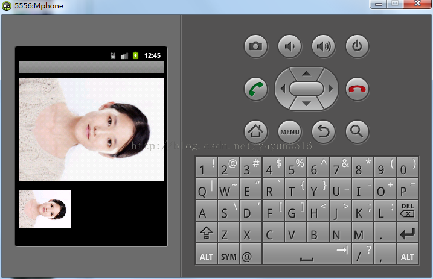

# 百战经典第八战-BitmapFactory.Options对资源图片进行缩放

We all know，编写的应用程序都是有一定内存限制的，程序占用了过高的内存就容易出现OOM(OutOfMemory)异常。因此在展示高分辨率图片的时候，最好先将图片进行压缩，压缩后的图片大小应该和用来展示它的控件大小相近，这样可以协调显示效果和内存占用。

BitmapFactory.Options这个类，有一个字段叫做 inJustDecodeBounds 。SDK中对这个成员的说明是这样的：
If set to true, the decoder will return null (no bitmap), but the out…
也就是说，如果我们把它设为true，那么BitmapFactory.decodeFile(String path, Options opt)并不会真的返回一个Bitmap给你，它仅仅会把它的宽，高取回来给你，这样就不会占用太多的内存，也就不会那么频繁的发生OOM了。

下面通过具体实例来展示怎么实现缩略图。

1.布局文件：

```
<?xml version="1.0" encoding="utf-8"?>  
<RelativeLayout xmlns:android="http://schemas.android.com/apk/res/android"  
    android:layout_width="match_parent"  
    android:layout_height="match_parent"  
    android:orientation="vertical" >  
    <ImageView  
        android:id="@+id/imageView1"  
        android:layout_width="match_parent"  
        android:layout_height="wrap_content"  
        android:src="@drawable/mei" />  
    <ImageView  
        android:id="@+id/imageView2"  
        android:layout_width="wrap_content"  
        android:layout_below="@+id/imageView1"  
        android:layout_height="wrap_content"  
        android:layout_marginTop="10dp"  
        android:src="@drawable/mei" />  
</RelativeLayout>  
```

2.MainActivity.java代码如下：

```
package org.yayun.demo;  
//省略导入包   
public class MainActivity extends Activity {  
    private ImageView imageView1;  
    private ImageView imageView2;  
    Bitmap mBitmap;  
    @Override  
    protected void onCreate(Bundle savedInstanceState) {  
        super.onCreate(savedInstanceState);  
        setContentView(R.layout.main);  
        initView();  
    }  
    private void initView(){  
        imageView1=(ImageView)findViewById(R.id.imageView1);  
        imageView2=(ImageView)findViewById(R.id.imageView2);  
        //读取资源图片  
        mBitmap=readBitMap();  
        //对资源图片进行缩放  
        imageView2.setImageBitmap(zoomBitmap(mBitmap, mBitmap.getWidth()/4, mBitmap.getHeight()/4));  
    }  
    /** 
     * 读取资源图片 
     * @return  
     */  
    private Bitmap readBitMap(){  
        BitmapFactory.Options opt=new BitmapFactory.Options();  
        /* 
         * 设置让解码器以最佳方式解码 
         */  
        opt.inPreferredConfig=Bitmap.Config.RGB_565;  
        //下面两个字段需要组合使用  
        opt.inPurgeable=true;  
        opt.inInputShareable=true;  
        /* 
         * 获取资源图片 
         */  
        InputStream is=this.getResources().openRawResource(R.drawable.mei);  
        return BitmapFactory.decodeStream(is, null, opt);  
    }   
    /** 
     * 缩放图片 
     * @param bitmap 
     * @param w 
     * @param h 
     * @return 
     */  
    public  Bitmap zoomBitmap(Bitmap bitmap, int w, int h) {  
        int width = bitmap.getWidth();  
        int height = bitmap.getHeight();  
        Matrix matrix = new Matrix();  
        float scaleWidht = ((float) w / width);  
        float scaleHeight = ((float) h / height);  
        /* 
         * 通过Matrix类的postScale方法进行缩放 
         */  
        matrix.postScale(scaleWidht, scaleHeight);  
        Bitmap newbmp = Bitmap.createBitmap(bitmap, 0, 0, width, height, matrix, true);  
        return newbmp;  
    }    
}  
```

定义了两个ImageView，第一个ImageView不进行任何操作，直接显示图片，第二个图片进行了压缩显示。上面代码中主要包含了两个方法，readBitMap和zoomBitmap方法。readBitMap先通过流的方式将资源文件读入，然后调用了BitmapFactory的decodeStream方法将流转换成Bitmap对象返回。zoomBitmap是实现图片缩放的方法，需要三个参数，bitmap，w 和h，bitmap就是前一个方法获取的对象，w和h是压缩比。这里将原图片的宽高压缩至原来的1/4。调用Matrix类的postScale方法进行了图片的压缩，最后将压缩后的bitmap对象返回，设置在imageview中，工作就结束了。

3.运行实例：



一般开发中都会对图片资源进行压缩，否则图片较多的情况下，极有可能造成内存不足的情况。