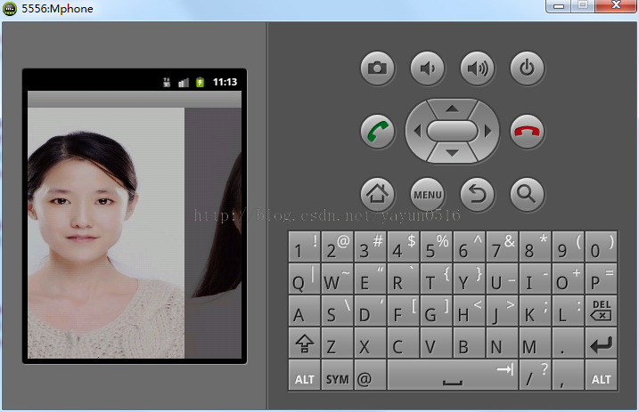

# 百战经典第九战-ViewFlipper实现幻灯效果

ViewFlipper 在实际项目中用到的不是很多了，但是作为初学者的我们还是有必要了解一下它的主要用法，本实例结合手势类（GestureDetector），实现滑动浏览图片的功能。

### 直接看代码

1.MainActivity.java:

```
package org.yayun.demo;  
//省略导入包
public class MainActivity extends Activity implements  
        android.view.GestureDetector.OnGestureListener {  
    private int[] imgs = { R.drawable.img1, R.drawable.img2, R.drawable.img3 };  
    private GestureDetector gestureDetector;  
    private ViewFlipper viewFlipper;  
    private Activity mActivity;  
    @Override  
    protected void onCreate(Bundle savedInstanceState) {  
        super.onCreate(savedInstanceState);  
        setContentView(R.layout.activity_main);  
        mActivity = this;  
        viewFlipper = (ViewFlipper) findViewById(R.id.viewflipper);  
        gestureDetector = new GestureDetector(this);//手势监听  
        for (int i = 0; i < imgs.length; i++) { // 添加图片源  
            ImageView iv = new ImageView(this);  
            iv.setImageResource(imgs[i]);  
            iv.setScaleType(ImageView.ScaleType.FIT_XY);  
            viewFlipper.addView(iv, new LayoutParams(LayoutParams.FILL_PARENT,  
                    LayoutParams.FILL_PARENT));  
        }  
        viewFlipper.setAutoStart(true); // 设置自动播放功能（点击事件，前自动播放）  
        viewFlipper.setFlipInterval(3000);//间隔3秒  
        if (viewFlipper.isAutoStart() && !viewFlipper.isFlipping()) {  
            viewFlipper.startFlipping();  
        }  
    }  
    @Override  
    public boolean onTouchEvent(MotionEvent event) {  
        viewFlipper.stopFlipping(); // 点击事件后，停止自动播放  
        viewFlipper.setAutoStart(false);  
        return gestureDetector.onTouchEvent(event); // 注册手势事件  
    }  
    public boolean onDown(MotionEvent arg0) {  
        return false;  
    }  
    public boolean onFling(MotionEvent e1, MotionEvent e2, float arg2,  
            float arg3) {  
        if (e2.getX() - e1.getX() > 120) { // 从左向右滑动（左进右出）  
            Animation rInAnim = AnimationUtils.loadAnimation(mActivity,  
                R.layout.push_right_in); // 向右滑动左侧进入的渐变效果（alpha 0.1 -> 1.0）  
            Animation rOutAnim = AnimationUtils.loadAnimation(mActivity,  
                    R.layout.push_right_out); // 向右滑动右侧滑出的渐变效果（alpha 1.0 -> 0.1）  
            viewFlipper.setInAnimation(rInAnim);  
            viewFlipper.setOutAnimation(rOutAnim);  
            viewFlipper.showPrevious();  
            return true;  
        } else if (e2.getX() - e1.getX() < -120) { // 从右向左滑动（右进左出）  
            Animation lInAnim = AnimationUtils.loadAnimation(mActivity,  
                    R.layout.push_left_in); // 向左滑动左侧进入的渐变效果（alpha 0.1 -> 1.0）  
            Animation lOutAnim = AnimationUtils.loadAnimation(mActivity,  
                    R.layout.push_left_out); // 向左滑动右侧滑出的渐变效果（alpha 1.0 -> 0.1）  
            viewFlipper.setInAnimation(lInAnim);  
            viewFlipper.setOutAnimation(lOutAnim);  
            viewFlipper.showNext();  
            return true;  
        }  
        return true;  
    }  
    public void onLongPress(MotionEvent arg0) {  
    }  
    public boolean onScroll(MotionEvent arg0, MotionEvent arg1, float arg2,  
            float arg3) {  
        return false;  
    }  
    public void onShowPress(MotionEvent arg0) {  
    }  
    public boolean onSingleTapUp(MotionEvent arg0) {  
        return false;  
    }  
} 
```

代码中进行了丰富的注释，就不再进行解释了，这里覆写了onTouchEvent方法，结合这个方法进行左划和右划的判断，要注意。

2.activity_main.xml:

```
<?xml version="1.0" encoding="utf-8"?>    
<LinearLayout xmlns:android="http://schemas.android.com/apk/res/android"    
    android:layout_width="fill_parent"    
    android:layout_height="fill_parent"    
    android:orientation="vertical" >    
    <ViewFlipper    
        android:id="@+id/viewflipper"    
        android:layout_width="fill_parent"    
        android:layout_height="fill_parent"/>    
</LinearLayout>  
```

下面是四个动画文件，很简单.

1.push_left_in.xml：（实现位移和渐变动画）

```
<?xml version="1.0" encoding="utf-8"?>      
<set xmlns:android="http://schemas.android.com/apk/res/android" >      
    <translate      
        android:duration="1500"      
        android:fromXDelta="100%p"      
        android:toXDelta="0" />  <!-- 位移   -->  
    <alpha      
        android:duration="1500"      
        android:fromAlpha="0.1"      
        android:toAlpha="1.0" /> <!-- 渐变    -->  
</set>   
```

2.push_left_out.xml：（位移和渐变动画）

```
<?xml version="1.0" encoding="utf-8"?>      
<set xmlns:android="http://schemas.android.com/apk/res/android" >      
    <translate      
        android:duration="1500"      
        android:fromXDelta="0"      
        android:toXDelta="-100%p" />      
    <alpha      
        android:duration="1500"      
        android:fromAlpha="1.0"      
        android:toAlpha="0.1" />      
</set>  
```

3.push_right_in.xml：

```
<?xml version="1.0" encoding="utf-8"?>      
<set xmlns:android="http://schemas.android.com/apk/res/android" >      
    <translate      
        android:duration="1500"      
        android:fromXDelta="-100%p"      
        android:toXDelta="0" />      
    <alpha      
        android:duration="1500"      
        android:fromAlpha="0.1"      
        android:toAlpha="1.0" />      
</set> 
```

4.push_right_out.xml

```
<?xml version="1.0" encoding="utf-8"?>      
<set xmlns:android="http://schemas.android.com/apk/res/android" >      
    <translate      
        android:duration="1500"      
        android:fromXDelta="0"      
        android:toXDelta="100%p" />      
    <alpha      
        android:duration="1500"      
        android:fromAlpha="1.0"      
        android:toAlpha="0.1" />      
</set>
```

运行实例如下：



### 总结

Android sdk提供了GestureDetector（Gesture：手势Detector：识别）类，通过这个类可以识别很多的手势，主要是通过他的`onTouchEvent(event)`方法完成了不同手势的识别。

GestureDetector这个类对外提供了两个接口：`OnGestureListener`，`OnDoubleTapListener`，还有一个内部类SimpleOnGestureListener。

本程序覆写了OnGestureListener的`onFling(MotionEvent e1, MotionEvent e2, float velocityX, float velocityY)`方法，Touch了滑动一点距离后，在ACTION_UP时才会触发。

参数：

- e1    第1个ACTION_DOWN MotionEvent 并且只有一个；
- e2    最后一个ACTION_MOVE MotionEvent    ；
- velocityX    X轴上的移动速度，像素/秒 ；
- velocityY    Y轴上的移动速度，像素/秒.触发条件：X轴的坐标位移大于FLING_MIN_DISTANCE，且移动速度大于FLING_MIN_VELOCITY个像素/秒
 